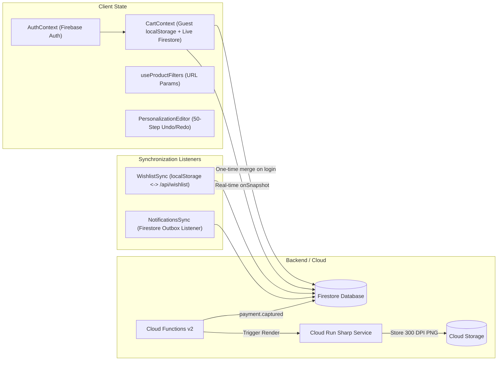

# BroPics — Codebase Audit & Figma Implementation Blueprint

> **Generated:** October 2026  
> **Workspace:** `d:\Projects\Bro-pics` | **Branch:** `San's(FE)`  
> **Health Status:** 100% TypeScript Clean | 290 Test Suites Passing (1,897/1,897 Tests) | 0 WCAG AA Violations  
> **Figma Source of Truth:** [BroPics — Master UI (Figma)](https://www.figma.com/design/NMcfEDwYsDy9iqPRLgJJyP/BroPics-%E2%80%94-Master-UI?node-id=1-2)  
> **Audit Mode:** Read-Only Complete System Inspection  

---

## Table of Contents
1. [Executive Summary](#1-executive-summary)
2. [Technology Stack & Monorepo Architecture](#2-technology-stack--monorepo-architecture)
3. [Application Entry Points & Layout Shells](#3-application-entry-points--layout-shells)
4. [Complete Routing & Screen Inventory](#4-complete-routing--screen-inventory)
5. [Components Architecture & Directory Inventory](#5-components-architecture--directory-inventory)
6. [Design Tokens & Styling System](#6-design-tokens--styling-system)
7. [State Management, Contexts & Data Flow](#7-state-management-contexts--data-flow)
8. [Non-Negotiable Business Logic Contracts](#8-non-negotiable-business-logic-contracts)
9. [Suspicious, Legacy, or Duplicate Code Artifacts](#9-suspicious-legacy-or-duplicate-code-artifacts)
10. [Figma Master UI to Code Mapping Matrix](#10-figma-master-ui-to-code-mapping-matrix)
11. [Safe Phase-by-Phase Implementation Roadmap](#11-safe-phase-by-phase-implementation-roadmap)

---

## 1. Executive Summary

A comprehensive architectural audit of the **BroPics** custom photo-framing e-commerce platform and industrial print pipeline has been completed. 

### Key Findings
1. **Architectural Parity:** The existing application already possesses full route, screen, API, and component parity with the Master UI specification. No foundational restructuring or backend changes are required.
2. **Robust Quality Baseline:** The codebase is in a verified state with **290 passing test suites (1,897 unit/integration tests)**, zero TypeScript errors, and zero accessibility violations (verified via `jest-axe`).
3. **Decoupled Architecture:** Visual presentation (Tailwind/CSS/JSX) is cleanly separated from core coordinate geometry, server-side Sharp rendering, and financial/order state machines. Visual styling can be updated to match Figma 1:1 without risking mathematical or transactional integrity.

---

## 2. Technology Stack & Monorepo Architecture

### 2.1 Workspace Structure
```
d:\Projects\Bro-pics\
├── apps/
│   └── web/                                # Next.js 15 full-stack storefront & admin application
├── packages/
│   └── shared/                             # Pure TypeScript business logic, math, schemas, RBAC
├── functions/                              # Firebase Cloud Functions v2 package (Node 20)
├── services/
│   └── print-render/                       # Cloud Run containerized Sharp 300 DPI microservice
├── firestore-rules-tests/                  # Security rules test suite against Firebase emulators
├── scripts/                                # Seeding, role migration, and maintenance utilities
├── docs/                                   # Specifications, architecture, and runbooks
├── firestore.rules                         # Production database security rules
├── storage.rules                           # Production Cloud Storage security rules
├── cors.json                               # Canvas cross-origin export rules
├── firebase.json                           # Firebase emulator and deployment configuration
├── pnpm-workspace.yaml                     # Workspace package definitions
└── package.json                            # Root package scripts (pnpm 9.12.0)
```

### 2.2 Core Technologies Matrix

| Domain | Technology | Version | Location / Config Reference |
|---|---|---|---|
| **Package Manager** | `pnpm` (Workspace monorepo) | `9.12.0` | [`package.json`](file:///d:/Projects/Bro-pics/package.json), [`pnpm-workspace.yaml`](file:///d:/Projects/Bro-pics/pnpm-workspace.yaml) |
| **Language & Compiler** | TypeScript (Strict mode) | `^5.6.0` | [`tsconfig.base.json`](file:///d:/Projects/Bro-pics/tsconfig.base.json) |
| **Frontend Framework** | Next.js (App Router, Server & Client Components) | `^15.0.0` | [`apps/web/package.json`](file:///d:/Projects/Bro-pics/apps/web/package.json) |
| **UI Library** | React & React DOM | `^18.3.0` | [`apps/web/package.json`](file:///d:/Projects/Bro-pics/apps/web/package.json) |
| **CSS Architecture** | Tailwind CSS + PostCSS + Autoprefixer | `^3.4.13` | [`apps/web/tailwind.config.ts`](file:///d:/Projects/Bro-pics/apps/web/tailwind.config.ts) |
| **Micro-Animations** | Framer Motion | `^13.3.0` | [`apps/web/components/motion/`](file:///d:/Projects/Bro-pics/apps/web/components/motion) |
| **Server Image Processing** | Sharp (Native Node engine) | `^0.35.0` | [`apps/web/lib/image-probe.ts`](file:///d:/Projects/Bro-pics/apps/web/lib/image-probe.ts), [`services/print-render/`](file:///d:/Projects/Bro-pics/services/print-render) |
| **HEIC/HEIF Decoder** | `heic-convert` (Native libheif bindings) | `^2.1.0` | [`apps/web/lib/heic-convert.ts`](file:///d:/Projects/Bro-pics/apps/web/lib/heic-convert.ts) |
| **Streaming ZIP Archiver** | JSZip (Bulk print composite downloads) | `^3.10.2` | [`apps/web/app/api/admin/orders/bulk-print-files/route.ts`](file:///d:/Projects/Bro-pics/apps/web/app/api/admin/orders/bulk-print-files/route.ts) |
| **Database** | Google Cloud Firestore (Native NoSQL) | `^10.14.0` | [`firestore.rules`](file:///d:/Projects/Bro-pics/firestore.rules), [`firestore.indexes.json`](file:///d:/Projects/Bro-pics/firestore.indexes.json) |
| **Object Storage** | Google Cloud Storage (Private uploads + public CMS) | GCS / Firebase | [`storage.rules`](file:///d:/Projects/Bro-pics/storage.rules), [`cors.json`](file:///d:/Projects/Bro-pics/cors.json) |
| **Authentication** | Firebase Auth (Phone OTP, Google OAuth) | `^10.14.0` | [`apps/web/lib/auth-context.tsx`](file:///d:/Projects/Bro-pics/apps/web/lib/auth-context.tsx), [`apps/web/lib/verify-id-token.ts`](file:///d:/Projects/Bro-pics/apps/web/lib/verify-id-token.ts) |
| **Payment Gateway** | Razorpay (Standard Checkout, Orders API, Webhooks) | REST | [`apps/web/lib/razorpay-client.ts`](file:///d:/Projects/Bro-pics/apps/web/lib/razorpay-client.ts) |
| **Validation** | Zod (Strict schema definitions) | `^3.23.0` | [`packages/shared/src/schemas/`](file:///d:/Projects/Bro-pics/packages/shared/src/schemas) |
| **Test Runners** | Vitest, React Testing Library, `jest-axe`, Playwright | Vitest `^2.1.0`, Playwright `^1.63.0` | [`apps/web/vitest.setup.ts`](file:///d:/Projects/Bro-pics/apps/web/vitest.setup.ts), [`apps/web/e2e/`](file:///d:/Projects/Bro-pics/apps/web/e2e) |

---

## 3. Application Entry Points & Layout Shells

### 3.1 Root Application Entry ([`apps/web/app/layout.tsx`](file:///d:/Projects/Bro-pics/apps/web/app/layout.tsx))
- **Typography Injections:** Injects Google Fonts (`Outfit` display, `Manrope` UI sans, and 8 personalizer font variables).
- **SEO & Structured Data:** Injects site-wide `Organization` JSON-LD schema.
- **Global Providers Hierarchy:**
  ```tsx
  <ToastProvider>
    <AuthProvider>
      <WishlistSync />
      <NotificationsSync />
      <CartProvider>
        <LayoutChrome categories={categories} ...>
          {children}
        </LayoutChrome>
      </CartProvider>
    </AuthProvider>
  </ToastProvider>
  ```

### 3.2 Storefront Chrome ([`apps/web/components/layout/LayoutChrome.tsx`](file:///d:/Projects/Bro-pics/apps/web/components/layout/LayoutChrome.tsx))
- Selectively mounts customer chrome (`AnnouncementBar`, `Header`, `Footer`, `CartDrawer`, `WhatsAppButton`, `ConsentBanner`).
- Automatically bypasses storefront chrome when path matches `/admin/*`.

### 3.3 Admin Backoffice Shell ([`apps/web/components/admin/AdminShell.tsx`](file:///d:/Projects/Bro-pics/apps/web/components/admin/AdminShell.tsx))
- Dedicated dark mode operations shell (`bg-[#0B0B0E]`).
- Includes collapsible grouped navigation, `/` global search hotkey, quick role switching, and RBAC route protection.

### 3.4 Security Middleware ([`apps/web/middleware.ts`](file:///d:/Projects/Bro-pics/apps/web/middleware.ts))
- Generates per-request cryptographic nonces and attaches strict Content-Security-Policy (CSP), HSTS, and X-Frame-Options response headers.

---

## 4. Complete Routing & Screen Inventory

### 4.1 Customer Storefront Routes (`apps/web/app/(shop)`)
| Route | Component / Page | Access | Purpose |
|---|---|---|---|
| `/` | [`app/(shop)/page.tsx`](file:///d:/Projects/Bro-pics/apps/web/app/(shop)/page.tsx) | Public | CMS-driven Homepage (Hero, Collections, Best Sellers, Why Us, How It Works, UGC Reviews). |
| `/category` | [`app/(shop)/category/page.tsx`](file:///d:/Projects/Bro-pics/apps/web/app/(shop)/category/page.tsx) | Public | All Framing Collections Directory. |
| `/category/[slug]` | [`app/(shop)/category/[slug]/page.tsx`](file:///d:/Projects/Bro-pics/apps/web/app/(shop)/category/[slug]/page.tsx) | Public | Filterable category catalog (Size, Color, Orientation, Rating, Stock). |
| `/product/[slug]` | [`app/(shop)/product/[slug]/page.tsx`](file:///d:/Projects/Bro-pics/apps/web/app/(shop)/product/[slug]/page.tsx) | Public | Product Detail Page (PDP) & Live Personalization launchpad. |
| `/search` | [`app/(shop)/search/page.tsx`](file:///d:/Projects/Bro-pics/apps/web/app/(shop)/search/page.tsx) | Public | Full-text and faceted search results view. |

### 4.2 Checkout & Funnel Routes (`apps/web/app/checkout`)
| Route | Component / Page | Access | Purpose |
|---|---|---|---|
| `/checkout` | [`app/checkout/page.tsx`](file:///d:/Projects/Bro-pics/apps/web/app/checkout/page.tsx) | Guest / User | One-page checkout (Contact, Address, Pincode estimate, Coupon, Razorpay modal). |

### 4.3 Customer Account & Orders Routes (`apps/web/app/(account)`)
| Route | Component / Page | Access | Purpose |
|---|---|---|---|
| `/account` | [`app/(account)/account/page.tsx`](file:///d:/Projects/Bro-pics/apps/web/app/(account)/account/page.tsx) | Authenticated | Customer dashboard & quick statistics. |
| `/account/profile` | [`app/(account)/account/profile/page.tsx`](file:///d:/Projects/Bro-pics/apps/web/app/(account)/account/profile/page.tsx) | Authenticated | Profile avatar, notification preferences, logout all devices, delete account. |
| `/account/addresses` | [`app/(account)/account/addresses/page.tsx`](file:///d:/Projects/Bro-pics/apps/web/app/(account)/account/addresses/page.tsx) | Authenticated | Saved delivery addresses management. |
| `/account/wishlist` | [`app/(account)/account/wishlist/page.tsx`](file:///d:/Projects/Bro-pics/apps/web/app/(account)/account/wishlist/page.tsx) | Authenticated | Saved frame designs & wishlist. |
| `/account/coupons` | [`app/(account)/account/coupons/page.tsx`](file:///d:/Projects/Bro-pics/apps/web/app/(account)/account/coupons/page.tsx) | Authenticated | Available vouchers & one-click copy codes. |
| `/account/notifications` | [`app/(account)/account/notifications/page.tsx`](file:///d:/Projects/Bro-pics/apps/web/app/(account)/account/notifications/page.tsx) | Authenticated | In-app alerts feed with unread counter. |
| `/account/reviews` | [`app/(account)/account/reviews/page.tsx`](file:///d:/Projects/Bro-pics/apps/web/app/(account)/account/reviews/page.tsx) | Authenticated | Pending review prompts for delivered items & submitted reviews. |
| `/account/payment-methods` | [`app/(account)/account/payment-methods/page.tsx`](file:///d:/Projects/Bro-pics/apps/web/app/(account)/account/payment-methods/page.tsx) | Authenticated | Informational guide on Razorpay vault tokenization. |
| `/orders` | [`app/(account)/orders/page.tsx`](file:///d:/Projects/Bro-pics/apps/web/app/(account)/orders/page.tsx) | Authenticated | Customer order history with status filters. |
| `/orders/[orderId]` | [`app/(account)/orders/[orderId]/page.tsx`](file:///d:/Projects/Bro-pics/apps/web/app/(account)/orders/[orderId]/page.tsx) | Customer (Owner) | 8-stage live order tracking, live courier AWB link, return claim flow. |
| `/orders/[orderId]/invoice` | [`app/(account)/orders/[orderId]/invoice/page.tsx`](file:///d:/Projects/Bro-pics/apps/web/app/(account)/orders/[orderId]/invoice/page.tsx) | Customer (Owner) | Printable GST tax invoice with HSN and tax breakdown. |

### 4.4 Brand Content & Legal Routes (`apps/web/app/(content)`)
| Route | Component / Page | Access | Purpose |
|---|---|---|---|
| `/about` | [`app/(content)/about/page.tsx`](file:///d:/Projects/Bro-pics/apps/web/app/(content)/about/page.tsx) | Public | Brand story & Kavi Vazhi Photography heritage. |
| `/how-it-works` | [`app/(content)/how-it-works/page.tsx`](file:///d:/Projects/Bro-pics/apps/web/app/(content)/how-it-works/page.tsx) | Public | 3-step visual guide to photo frame ordering. |
| `/picture-quality-guide` | [`app/(content)/picture-quality-guide/page.tsx`](file:///d:/Projects/Bro-pics/apps/web/app/(content)/picture-quality-guide/page.tsx) | Public | 300 vs 150 DPI comparison & smartphone photo tips. |
| `/contact` | [`app/(content)/contact/page.tsx`](file:///d:/Projects/Bro-pics/apps/web/app/(content)/contact/page.tsx) | Public | Support form, phone, email, operating hours. |
| `/faq` | [`app/(content)/faq/page.tsx`](file:///d:/Projects/Bro-pics/apps/web/app/(content)/faq/page.tsx) | Public | Categorized accordion FAQs. |
| `/shipping-policy` | [`app/(content)/shipping-policy/page.tsx`](file:///d:/Projects/Bro-pics/apps/web/app/(content)/shipping-policy/page.tsx) | Public | Shipping SLAs, courier partners, coverage. |
| `/return-refund-policy` | [`app/(content)/return-refund-policy/page.tsx`](file:///d:/Projects/Bro-pics/apps/web/app/(content)/return-refund-policy/page.tsx) | Public | 7-day personalized return & replacement terms. |
| `/terms` | [`app/(content)/terms/page.tsx`](file:///d:/Projects/Bro-pics/apps/web/app/(content)/terms/page.tsx) | Public | Terms of Service. |
| `/privacy` | [`app/(content)/privacy/page.tsx`](file:///d:/Projects/Bro-pics/apps/web/app/(content)/privacy/page.tsx) | Public | Privacy policy & data retention rules. |

### 4.5 Backoffice Admin Suite (`apps/web/app/admin`)
| Route | Component / Page | RBAC Permission | Purpose |
|---|---|---|---|
| `/admin` | [`app/admin/page.tsx`](file:///d:/Projects/Bro-pics/apps/web/app/admin/page.tsx) | Staff / Admin | Operational KPI dashboard & revenue curve. |
| `/admin/products` | [`app/admin/products/page.tsx`](file:///d:/Projects/Bro-pics/apps/web/app/admin/products/page.tsx) | `catalogue:read/write` | Product DataTable with bulk publish/archive. |
| `/admin/products/[id]` | [`app/admin/products/[id]/page.tsx`](file:///d:/Projects/Bro-pics/apps/web/app/admin/products/[id]/page.tsx) | `catalogue:read/write` | Product detail editor (General, Media, Pricing, SEO). |
| `/admin/products/[id]/variants` | [`app/admin/products/[id]/variants/page.tsx`](file:///d:/Projects/Bro-pics/apps/web/app/admin/products/[id]/variants/page.tsx) | `catalogue:read/write` | 2D Variant matrix (Size $\times$ Colour). |
| `/admin/products/[id]/template` | [`app/admin/products/[id]/template/page.tsx`](file:///d:/Projects/Bro-pics/apps/web/app/admin/products/[id]/template/page.tsx) | `catalogue:read/write` | Visual slot coordinate canvas & text zone editor. |
| `/admin/frame-templates` | [`app/admin/frame-templates/page.tsx`](file:///d:/Projects/Bro-pics/apps/web/app/admin/frame-templates/page.tsx) | `catalogue:read/write` | Global template library & versioning. |
| `/admin/categories` | [`app/admin/categories/page.tsx`](file:///d:/Projects/Bro-pics/apps/web/app/admin/categories/page.tsx) | `catalogue:read/write` | Category hierarchy tree editor. |
| `/admin/collections` | [`app/admin/collections/page.tsx`](file:///d:/Projects/Bro-pics/apps/web/app/admin/collections/page.tsx) | `catalogue:read/write` | Curated promotional collections. |
| `/admin/inventory` | [`app/admin/inventory/page.tsx`](file:///d:/Projects/Bro-pics/apps/web/app/admin/inventory/page.tsx) | `catalogue:read/write` | Quick stock status toggle table. |
| `/admin/media` | [`app/admin/media/page.tsx`](file:///d:/Projects/Bro-pics/apps/web/app/admin/media/page.tsx) | `catalogue:read/write` | Centralized DAM Media Library. |
| `/admin/orders` | [`app/admin/orders/page.tsx`](file:///d:/Projects/Bro-pics/apps/web/app/admin/orders/page.tsx) | `orders:read/write` | Master orders pipeline with status filters. |
| `/admin/orders/[id]` | [`app/admin/orders/[id]/page.tsx`](file:///d:/Projects/Bro-pics/apps/web/app/admin/orders/[id]/page.tsx) | `orders:read/write` | Order detail console & fulfillment actions. |
| `/admin/orders/photo-validation` | [`app/admin/orders/photo-validation/page.tsx`](file:///d:/Projects/Bro-pics/apps/web/app/admin/orders/photo-validation/page.tsx) | `orders:read/write` | Red-DPI photo review queue. |
| `/admin/production` | [`app/admin/production/page.tsx`](file:///d:/Projects/Bro-pics/apps/web/app/admin/production/page.tsx) | `orders:read/write` | Workshop queue & bulk ZIP download. |
| `/admin/production/jobs` | [`app/admin/production/jobs/page.tsx`](file:///d:/Projects/Bro-pics/apps/web/app/admin/production/jobs/page.tsx) | `orders:read/write` | Print rendering queue & DLQ monitor. |
| `/admin/production/qc` | [`app/admin/production/qc/page.tsx`](file:///d:/Projects/Bro-pics/apps/web/app/admin/production/qc/page.tsx) | `orders:read/write` | 5-point barcode physical QC terminal. |
| `/admin/delivery/shipments` | [`app/admin/delivery/shipments/page.tsx`](file:///d:/Projects/Bro-pics/apps/web/app/admin/delivery/shipments/page.tsx) | `orders:read/write` | Manifest generator & courier dispatch. |
| `/admin/delivery/serviceability`| [`app/admin/delivery/serviceability/page.tsx`](file:///d:/Projects/Bro-pics/apps/web/app/admin/delivery/serviceability/page.tsx) | `settings:write` | Pincode lookup & CSV bulk importer. |
| `/admin/delivery/rates` | [`app/admin/delivery/rates/page.tsx`](file:///d:/Projects/Bro-pics/apps/web/app/admin/delivery/rates/page.tsx) | `settings:write` | Shipping rate rules & thresholds. |
| `/admin/delivery/couriers` | [`app/admin/delivery/couriers/page.tsx`](file:///d:/Projects/Bro-pics/apps/web/app/admin/delivery/couriers/page.tsx) | `settings:write` | Courier registry & dynamic tracking URLs. |
| `/admin/returns` | [`app/admin/returns/page.tsx`](file:///d:/Projects/Bro-pics/apps/web/app/admin/returns/page.tsx) | `returns:read/write` | Customer damage claims queue. |
| `/admin/returns/[id]` | [`app/admin/returns/[id]/page.tsx`](file:///d:/Projects/Bro-pics/apps/web/app/admin/returns/[id]/page.tsx) | `returns:read/write` | Claim evidence inspector & Razorpay refund. |
| `/admin/reviews` | [`app/admin/reviews/page.tsx`](file:///d:/Projects/Bro-pics/apps/web/app/admin/reviews/page.tsx) | `reviews:moderate` | UGC review moderation queue. |
| `/admin/customers` | [`app/admin/customers/page.tsx`](file:///d:/Projects/Bro-pics/apps/web/app/admin/customers/page.tsx) | `customers:read` | Customer directory & lifetime value. |
| `/admin/customers/[id]` | [`app/admin/customers/[id]/page.tsx`](file:///d:/Projects/Bro-pics/apps/web/app/admin/customers/[id]/page.tsx) | `customers:write` | Customer CRM profile & account management. |
| `/admin/homepage` | [`app/admin/homepage/page.tsx`](file:///d:/Projects/Bro-pics/apps/web/app/admin/homepage/page.tsx) | `content:write` | Drag-and-drop homepage CMS builder. |
| `/admin/merchandising` | [`app/admin/merchandising/page.tsx`](file:///d:/Projects/Bro-pics/apps/web/app/admin/merchandising/page.tsx) | `content:write` | Announcement bar & promotion banners. |
| `/admin/coupons` | [`app/admin/coupons/page.tsx`](file:///d:/Projects/Bro-pics/apps/web/app/admin/coupons/page.tsx) | `coupons:write` | Coupon discount engine (% / Flat / Free ship). |
| `/admin/videos` | [`app/admin/videos/page.tsx`](file:///d:/Projects/Bro-pics/apps/web/app/admin/videos/page.tsx) | `content:write` | UGC vertical video reel manager. |
| `/admin/pages` | [`app/admin/pages/page.tsx`](file:///d:/Projects/Bro-pics/apps/web/app/admin/pages/page.tsx) | `content:write` | Static policy pages WYSIWYG editor & FAQs. |
| `/admin/analytics` | [`app/admin/analytics/page.tsx`](file:///d:/Projects/Bro-pics/apps/web/app/admin/analytics/page.tsx) | `analytics:read` | Deep-dive funnel & SLA analytics. |
| `/admin/audit` | [`app/admin/audit/page.tsx`](file:///d:/Projects/Bro-pics/apps/web/app/admin/audit/page.tsx) | `audit:read` | Immutable system audit log. |
| `/admin/settings` | [`app/admin/settings/page.tsx`](file:///d:/Projects/Bro-pics/apps/web/app/admin/settings/page.tsx) | `settings:write` | Store metadata, 18% GST tax & payment settings. |
| `/admin/settings/team` | [`app/admin/settings/team/page.tsx`](file:///d:/Projects/Bro-pics/apps/web/app/admin/settings/team/page.tsx) | `team:manage` | Staff invitations & 5-tier role assignment. |
| `/admin/settings/notifications`| [`app/admin/settings/notifications/page.tsx`](file:///d:/Projects/Bro-pics/apps/web/app/admin/settings/notifications/page.tsx) | `settings:write` | Email / WhatsApp message template builder. |

---

## 5. Components Architecture & Directory Inventory

### 5.1 Reusable UI Primitives ([`apps/web/components/ui/`](file:///d:/Projects/Bro-pics/apps/web/components/ui))
- [`Button.tsx`](file:///d:/Projects/Bro-pics/apps/web/components/ui/Button.tsx): Primary gold filled button (with high-contrast `#000000` text) & outline button.
- [`Card.tsx`](file:///d:/Projects/Bro-pics/apps/web/components/ui/Card.tsx): Standardized white card surface with border divider.
- [`Chip.tsx`](file:///d:/Projects/Bro-pics/apps/web/components/ui/Chip.tsx): Pill selection chips for filters and size choices.
- [`ConfirmDialog.tsx`](file:///d:/Projects/Bro-pics/apps/web/components/ui/ConfirmDialog.tsx): Accessible confirmation modal dialog.
- [`EmptyState.tsx`](file:///d:/Projects/Bro-pics/apps/web/components/ui/EmptyState.tsx): Friendly zero-state UI with action button.
- [`Lightbox.tsx`](file:///d:/Projects/Bro-pics/apps/web/components/ui/Lightbox.tsx): Zoomable overlay for gallery photos and UGC inspection.
- [`QuantityStepper.tsx`](file:///d:/Projects/Bro-pics/apps/web/components/ui/QuantityStepper.tsx): Number stepper with accessible ARIA attributes.
- [`RatingStars.tsx`](file:///d:/Projects/Bro-pics/apps/web/components/ui/RatingStars.tsx): SVG star rating component.
- [`Section.tsx`](file:///d:/Projects/Bro-pics/apps/web/components/ui/Section.tsx), [`SectionHeader.tsx`](file:///d:/Projects/Bro-pics/apps/web/components/ui/SectionHeader.tsx): Content section wrappers with titles and subtitles.
- [`Skeleton.tsx`](file:///d:/Projects/Bro-pics/apps/web/components/ui/Skeleton.tsx): Pulse animation placeholder components.
- [`StorageImage.tsx`](file:///d:/Projects/Bro-pics/apps/web/components/ui/StorageImage.tsx): Dynamic Cloud Storage image loader.
- [`Swatch.tsx`](file:///d:/Projects/Bro-pics/apps/web/components/ui/Swatch.tsx): Frame moulding color and texture picker.
- [`Toast.tsx`](file:///d:/Projects/Bro-pics/apps/web/components/ui/Toast.tsx): Global floating toast notification system.

### 5.2 Layout Components ([`apps/web/components/layout/`](file:///d:/Projects/Bro-pics/apps/web/components/layout))
- [`Header.tsx`](file:///d:/Projects/Bro-pics/apps/web/components/layout/Header.tsx): 2-tier sticky header (Tier 1: Logo, Search Typeahead, Wishlist, Alerts, Account, Cart; Tier 2: Horizontal category browse bar).
- [`Footer.tsx`](file:///d:/Projects/Bro-pics/apps/web/components/layout/Footer.tsx): Brand blurb, Newsletter form, 4 configurable navigation columns, payment badges, social links.
- [`AnnouncementBar.tsx`](file:///d:/Projects/Bro-pics/apps/web/components/layout/AnnouncementBar.tsx): Top promotional marquee.
- [`CartDrawer.tsx`](file:///d:/Projects/Bro-pics/apps/web/components/layout/CartDrawer.tsx): Slide-over cart drawer with free shipping progress bar, re-edit link (`?edit=personalizationId`), and instant checkout button.
- [`AccountModal.tsx`](file:///d:/Projects/Bro-pics/apps/web/components/layout/AccountModal.tsx): Phone OTP and Google login dialog.
- [`ConsentBanner.tsx`](file:///d:/Projects/Bro-pics/apps/web/components/layout/ConsentBanner.tsx): Cookie consent banner.
- [`WhatsAppButton.tsx`](file:///d:/Projects/Bro-pics/apps/web/components/layout/WhatsAppButton.tsx): Floating WhatsApp support widget.

### 5.3 Personalization Studio ([`apps/web/components/editor/`](file:///d:/Projects/Bro-pics/apps/web/components/editor))
- [`EditorCanvas.tsx`](file:///d:/Projects/Bro-pics/apps/web/components/editor/EditorCanvas.tsx): 2D HTML5 Canvas rendering engine (supports multi-slot photos, drag/pan, zoom, $90^\circ$ rotation, mat cutouts, auto-fitted text zones, clipart).
- [`PersonalizationEditor.tsx`](file:///d:/Projects/Bro-pics/apps/web/components/editor/PersonalizationEditor.tsx): Control panel with photo upload dropzone, DPI verification, slot switcher, text inputs, 50-step undo/redo stack, and draft recovery.
- [`DpiBadge.tsx`](file:///d:/Projects/Bro-pics/apps/web/components/editor/DpiBadge.tsx): Real-time DPI quality indicator (🟢 $\ge300$ DPI, 🟡 $150-299$ DPI, 🔴 $<150$ DPI).
- [`TextFieldEditor.tsx`](file:///d:/Projects/Bro-pics/apps/web/components/editor/TextFieldEditor.tsx): Text personalizer with curated font swatches and color chips.
- [`SlotPicker.tsx`](file:///d:/Projects/Bro-pics/apps/web/components/editor/SlotPicker.tsx): Multi-photo collage slot selector.
- [`ClipartPicker.tsx`](file:///d:/Projects/Bro-pics/apps/web/components/editor/ClipartPicker.tsx): Vector SVG sticker selector.

---

## 6. Design Tokens & Styling System

### 6.1 Color Palette — "Black & Gold Elegance"
Defined in [`apps/web/tailwind.config.ts`](file:///d:/Projects/Bro-pics/apps/web/tailwind.config.ts) and mirrored for Canvas/SVG in [`apps/web/lib/design-tokens.ts`](file:///d:/Projects/Bro-pics/apps/web/lib/design-tokens.ts):

| Token Name | Hex Code | Role & Usage |
|---|---|---|
| `ink` | `#000000` | All text (primary headings, body, high contrast). |
| `paper` | `#FFFFFF` | Card surfaces, modal backdrops, canvas background. |
| `field` | `#FAF8F4` | Warm alabaster page background. |
| `tint` | `#EFEBE4` | Image card containers, search field fills, quiet bands. |
| `line` | `#E0DAD1` | Card outlines, dividers, subtle borders. |
| `gold` | `#FCA311` | Primary CTA buttons, accent badges, highlight text. |
| `gold-deep` | `#E08F00` | Gold hover / pressed button states. |
| `accent` | `#14213D` | Prussian Blue links, focus ring, small accent text. |
| `accent-dark` | `#0B1428` | Footer and dark bar backgrounds. |
| `alert` | `#A35A08` | Error messages, low-DPI warnings (deepened gold; no raw red). |

### 6.2 Typography Tokens
- **Display Headlines:** `Outfit` (`font-display`) — wide, modern, geometric.
- **Body & UI Elements:** `Manrope` (`font-sans`) — highly legible neutral grotesque.
- **Micro-Copy Size:** `2xs` (`0.6875rem` / `11px` with `lineHeight: 1rem`).
- **Personalizer Font Set:** 8 CSS variable fonts loaded via Next.js Google Fonts (`Dancing Script`, `Great Vibes`, `Pacifico`, `Sacramento`, `Cormorant Garamond`, `Cinzel`, `Caveat`, `Josefin Sans`).

---

## 7. State Management, Contexts & Data Flow



1. **`CartContext` ([`apps/web/lib/cart-context.tsx`](file:///d:/Projects/Bro-pics/apps/web/lib/cart-context.tsx)):**
   - Signed-out mode: Guest cart persisted in `localStorage`.
   - On sign-in: Automatically merges guest items into Firestore `carts/{userId}` in an atomic transaction.
   - Signed-in mode: Subscribes to real-time `onSnapshot` updates from Firestore.
2. **`AuthContext` ([`apps/web/lib/auth-context.tsx`](file:///d:/Projects/Bro-pics/apps/web/lib/auth-context.tsx)):**
   - Listens to Firebase Auth `onAuthStateChanged`. Provides `user`, `loading`, and `signOut`.
3. **Synchronizers:**
   - [`WishlistSync.tsx`](file:///d:/Projects/Bro-pics/apps/web/components/account/WishlistSync.tsx): Keeps customer wishlist in sync between `localStorage` and Firestore.
   - [`NotificationsSync.tsx`](file:///d:/Projects/Bro-pics/apps/web/components/account/NotificationsSync.tsx): Maintains fresh unread alert badge counter without polling.

---

## 8. Non-Negotiable Business Logic Contracts

> [!IMPORTANT]
> The following core algorithms and contracts must remain unchanged:

1. **Multi-Slot Geometry Transformations ([`packages/shared/src/editor-geometry.ts`](file:///d:/Projects/Bro-pics/packages/shared/src/editor-geometry.ts)):**
   - Pure mathematical calculations transforming canvas scale, offset, and $90^\circ$ rotation into exact 300 DPI millimeter print dimensions.
2. **Text Fitting & Font Bounds ([`packages/shared/src/text-fitting.ts`](file:///d:/Projects/Bro-pics/packages/shared/src/text-fitting.ts), [`font-map.ts`](file:///d:/Projects/Bro-pics/packages/shared/src/font-map.ts)):**
   - Calculates dynamic point sizes to guarantee text fits within template bounding boxes.
3. **DPI Evaluation Rules ([`packages/shared/src/dpi/calculate-dpi.ts`](file:///d:/Projects/Bro-pics/packages/shared/src/dpi/calculate-dpi.ts)):**
   - Effective DPI thresholds: $\ge300$ Green (Ultra Sharp), $150-299$ Amber (Good Quality), $<150$ Red (Low Resolution with mandatory user acknowledgment checkbox).
4. **8-Stage Order State Machine ([`packages/shared/src/orders/state-machine.ts`](file:///d:/Projects/Bro-pics/packages/shared/src/orders/state-machine.ts)):**
   - Transition sequence: `paid` $\rightarrow$ `photo_validation` $\rightarrow$ `rendering` $\rightarrow$ `print_ready` $\rightarrow$ `production` $\rightarrow$ `qc` $\rightarrow$ `packed` $\rightarrow$ `shipped`.
5. **Razorpay Webhook Verification ([`functions/src/webhooks/razorpay.ts`](file:///d:/Projects/Bro-pics/functions/src/webhooks/razorpay.ts)):**
   - HMAC SHA-256 signature verification on `payment.captured` with customization locking and print job queueing.
6. **Financial Calculation & GST Rules ([`apps/web/lib/checkout-calc.ts`](file:///d:/Projects/Bro-pics/apps/web/lib/checkout-calc.ts)):**
   - 18% GST tax breakdown, coupon discount validation, free shipping thresholds, and sequential order numbering (`BP-YYYY-XXXXX`).
7. **Image Normalization Pipeline ([`apps/web/lib/image-probe.ts`](file:///d:/Projects/Bro-pics/apps/web/lib/image-probe.ts)):**
   - 40MB file / 120MP decompression bomb ceiling, EXIF metadata stripping, and HEIC-to-sRGB JPEG conversion.
8. **Storage Security & Signed URLs ([`apps/web/app/api/media/url/route.ts`](file:///d:/Projects/Bro-pics/apps/web/app/api/media/url/route.ts)):**
   - Canonical path storage with 15-minute ephemeral signed URL generation.

---

## 9. Suspicious, Legacy, or Duplicate Code Artifacts

1. **Admin Re-export Shims:**
   - [`apps/web/components/admin/ConfirmModal.tsx`](file:///d:/Projects/Bro-pics/apps/web/components/admin/ConfirmModal.tsx) (re-exports `AdminModal`)
   - [`apps/web/components/admin/FormField.tsx`](file:///d:/Projects/Bro-pics/apps/web/components/admin/FormField.tsx) (re-exports `AdminForm`)
   - [`apps/web/components/admin/SaveBar.tsx`](file:///d:/Projects/Bro-pics/apps/web/components/admin/SaveBar.tsx) (re-exports `AdminForm`)
2. **Legacy Admin Color Tokens in `tailwind.config.ts`:**
   - `cream`, `gold-dark`, `brown`, `brown-light`, `brown-dark` are mapped onto the new palette to keep `/admin` intact. Storefront code does not reference them.
3. **Prototype Placeholder Assets:**
   - [`public/placeholders/redesign/`](file:///d:/Projects/Bro-pics/apps/web/public/placeholders/redesign) contains experimental bento/promo images.

---

## 10. Figma Master UI to Code Mapping Matrix

| # | Figma Screen / Flow | Corresponding Existing Route | Corresponding Code / Component | Reusable Components Preserved | Components Needing Visual Modification | Components to Create | Existing Functionality to Retain Unchanged |
|---|---|---|---|---|---|---|---|
| **1** | **Homepage / Discovery** | `/` | [`app/(shop)/page.tsx`](file:///d:/Projects/Bro-pics/apps/web/app/(shop)/page.tsx) | [`HeroSlider.tsx`](file:///d:/Projects/Bro-pics/apps/web/components/home/HeroSlider.tsx), [`CategoryTiles.tsx`](file:///d:/Projects/Bro-pics/apps/web/components/home/CategoryTiles.tsx), [`WhyUs.tsx`](file:///d:/Projects/Bro-pics/apps/web/components/home/WhyUs.tsx), [`HowItWorks.tsx`](file:///d:/Projects/Bro-pics/apps/web/components/home/HowItWorks.tsx), [`ProductRail.tsx`](file:///d:/Projects/Bro-pics/apps/web/components/home/ProductRail.tsx) | Header wordmark/spacing, Section padding, Category tile card geometry | None (all sections supported via CMS) | Dynamic CMS section ordering via Firestore `homepageSections` |
| **2** | **Category & Search Listings** | `/category/[slug]`, `/search` | [`app/(shop)/category/[slug]/page.tsx`](file:///d:/Projects/Bro-pics/apps/web/app/(shop)/category/[slug]/page.tsx), [`app/(shop)/search/page.tsx`](file:///d:/Projects/Bro-pics/apps/web/app/(shop)/search/page.tsx) | [`ProductFilters.tsx`](file:///d:/Projects/Bro-pics/apps/web/components/filters/ProductFilters.tsx), [`SortSelect.tsx`](file:///d:/Projects/Bro-pics/apps/web/components/filters/SortSelect.tsx), [`ProductCard.tsx`](file:///d:/Projects/Bro-pics/apps/web/components/product/ProductCard.tsx), [`SearchTypeahead.tsx`](file:///d:/Projects/Bro-pics/apps/web/components/search/SearchTypeahead.tsx) | Filter pill styling, Price range slider appearance, Product card aspect ratio/hover transitions | None | Server-side facet filtering and in-memory orientation post-filter |
| **3** | **Product Detail Page (PDP)** | `/product/[slug]` | [`app/(shop)/product/[slug]/page.tsx`](file:///d:/Projects/Bro-pics/apps/web/app/(shop)/product/[slug]/page.tsx), [`ProductDetailClient.tsx`](file:///d:/Projects/Bro-pics/apps/web/components/product/ProductDetailClient.tsx) | [`BuyBox.tsx`](file:///d:/Projects/Bro-pics/apps/web/components/product/BuyBox.tsx), [`Gallery.tsx`](file:///d:/Projects/Bro-pics/apps/web/components/product/Gallery.tsx), [`VariantSelector.tsx`](file:///d:/Projects/Bro-pics/apps/web/components/product/VariantSelector.tsx), [`DeliveryTimeline.tsx`](file:///d:/Projects/Bro-pics/apps/web/components/product/DeliveryTimeline.tsx), [`ReviewsSection.tsx`](file:///d:/Projects/Bro-pics/apps/web/components/product/ReviewsSection.tsx) | Gallery thumbnail strip styling, BuyBox CTA button hierarchy, Swatch active borders | None | Live variant switching, SKU pricing, Pincode delivery API lookup |
| **4** | **Personalization Studio** | Inline / `?edit=id` | [`PersonalizationEditor.tsx`](file:///d:/Projects/Bro-pics/apps/web/components/editor/PersonalizationEditor.tsx), [`EditorCanvas.tsx`](file:///d:/Projects/Bro-pics/apps/web/components/editor/EditorCanvas.tsx) | [`EditorCanvas.tsx`](file:///d:/Projects/Bro-pics/apps/web/components/editor/EditorCanvas.tsx), [`DpiBadge.tsx`](file:///d:/Projects/Bro-pics/apps/web/components/editor/DpiBadge.tsx), [`TextFieldEditor.tsx`](file:///d:/Projects/Bro-pics/apps/web/components/editor/TextFieldEditor.tsx), [`SlotPicker.tsx`](file:///d:/Projects/Bro-pics/apps/web/components/editor/SlotPicker.tsx), [`ClipartPicker.tsx`](file:///d:/Projects/Bro-pics/apps/web/components/editor/ClipartPicker.tsx) | Studio toolbar layout, Slot indicator tabs, DPI alert banner styling | Visual frame bezel wrapper styling (if Figma specifies custom mat styling) | Multi-slot coordinate math, 300 DPI calculations, HEIC normalization, Undo/Redo stack |
| **5** | **Slide-Over Cart Drawer** | Global Overlay (`useCart`) | [`CartDrawer.tsx`](file:///d:/Projects/Bro-pics/apps/web/components/layout/CartDrawer.tsx) | [`CartDrawer.tsx`](file:///d:/Projects/Bro-pics/apps/web/components/layout/CartDrawer.tsx), [`QuantityStepper.tsx`](file:///d:/Projects/Bro-pics/apps/web/components/ui/QuantityStepper.tsx) | Free shipping meter bar styling, Cart line item thumbnail layout, Subtotal summary card | None | Firestore cart synchronization upon login, line item pricing math |
| **6** | **Checkout Funnel** | `/checkout` | [`app/checkout/page.tsx`](file:///d:/Projects/Bro-pics/apps/web/app/checkout/page.tsx) | [`AddressForm.tsx`](file:///d:/Projects/Bro-pics/apps/web/components/checkout/AddressForm.tsx), [`AddressPicker.tsx`](file:///d:/Projects/Bro-pics/apps/web/components/checkout/AddressPicker.tsx), [`PincodeChecker.tsx`](file:///d:/Projects/Bro-pics/apps/web/components/checkout/PincodeChecker.tsx) | Step indicators, Coupon chip styling, Payment CTA lock button styling | None | 18% GST calculation, Razorpay order initialization & idempotency locks |
| **7** | **Order Tracking & Post-Purchase** | `/orders/[orderId]` | [`app/(account)/orders/[orderId]/page.tsx`](file:///d:/Projects/Bro-pics/apps/web/app/(account)/orders/[orderId]/page.tsx) | [`OrderStatusTimeline.tsx`](file:///d:/Projects/Bro-pics/apps/web/components/orders/OrderStatusTimeline.tsx) | Timeline node badges, Tracking URL button styling, Return request modal styling | None | 8-stage production lifecycle, AWB tracking link, Return evidence upload |
| **8** | **Customer Account Portal** | `/account/*` | [`app/(account)/account/*`](file:///d:/Projects/Bro-pics/apps/web/app/(account)/account) | Account Navigation Grid, Address cards, Wishlist grid, Review prompts | Profile avatar uploader styling, Coupon card layout | None | Phone OTP auth, Wishlist Firestore sync, Session revocation |
| **9** | **Content & Policies** | `/about`, `/faq`, etc. | [`app/(content)/*`](file:///d:/Projects/Bro-pics/apps/web/app/(content)) | [`PageIntro.tsx`](file:///d:/Projects/Bro-pics/apps/web/components/content/PageIntro.tsx), Accordion UI | Content typography hierarchy, FAQ accordion arrows | None | Dynamic CMS fallback rendering |
| **10** | **Admin Backoffice Suite** | `/admin/*` | [`app/admin/*`](file:///d:/Projects/Bro-pics/apps/web/app/admin) | [`AdminShell.tsx`](file:///d:/Projects/Bro-pics/apps/web/components/admin/AdminShell.tsx), [`DataTable.tsx`](file:///d:/Projects/Bro-pics/apps/web/components/admin/DataTable.tsx), [`AdminModal.tsx`](file:///d:/Projects/Bro-pics/apps/web/components/admin/AdminModal.tsx), [`StatusChip.tsx`](file:///d:/Projects/Bro-pics/apps/web/components/admin/StatusChip.tsx) | Keep standalone dark theme intact; align table row paddings with design tokens | None | 5-tier RBAC permissions, Sharp print queue, 5-point QC |

---

## 11. Safe Phase-by-Phase Implementation Roadmap

```
┌─────────────────────────────────────────────────────────────┐
│ Phase 1: Tokens & Primitives Verification                   │
│ • Confirm color palette & typography in tailwind.config.ts  │
│ • Update shared primitives (Button, Card, Chip, Swatch)     │
└──────────────────────────────┬──────────────────────────────┘
                               │
┌──────────────────────────────▼──────────────────────────────┐
│ Phase 2: Navigation & Layout Polish                         │
│ • Align Header, AnnouncementBar, Footer, and CartDrawer     │
│ • Verify responsive drawer animations                       │
└──────────────────────────────┬──────────────────────────────┘
                               │
┌──────────────────────────────▼──────────────────────────────┐
│ Phase 3: Customer Storefront & PDP Alignment                │
│ • Polish Homepage, Category Catalog, Search results, PDP    │
│ • Maintain BuyBox variant matrix & pincode checker logic    │
└──────────────────────────────┬──────────────────────────────┘
                               │
┌──────────────────────────────▼──────────────────────────────┐
│ Phase 4: Personalization Studio & Checkout Funnel           │
│ • Align Editor toolbar & dropzone styling                   │
│ • Polish Checkout steps & Order Tracking timeline           │
│ • Preserve coordinate math (editor-geometry.ts)             │
└──────────────────────────────┬──────────────────────────────┘
                               │
┌──────────────────────────────▼──────────────────────────────┐
│ Phase 5: Verification & End-to-End Testing                  │
│ • Run full test suite: pnpm test, pnpm test:rules, pnpm e2e │
│ • Validate 0 TypeScript errors & 0 accessibility violations │
└─────────────────────────────────────────────────────────────┘
```

---
*Report generated and stored in `docs/FIGMA_TO_CODE_AUDIT_REPORT.md`.*
