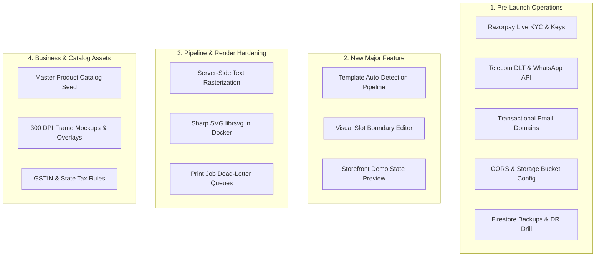

# BroPics — Project Status & Pending Works Master Plan

> **Last Updated:** September 2026  
> **Repository:** `d:\Projects\Bro-pics` | **Active Branch:** `San's(FE)`  
> **Monorepo Health:** 100% TypeScript Clean (`pnpm -r typecheck`) | **230 Test Suites Passing (1,500/1,500 Tests)**  
> **Production Readiness:** Code Complete across Core Storefront, Admin Backoffice, Cloud Functions, and Print Pipeline.

---

## 1. Executive Summary & Current Codebase Status

The **BroPics** custom photo-framing e-commerce platform and industrial print automation pipeline has reached **100% Code Completeness** for its planned foundation across all primary technical tracks:

1. **Customer Storefront (`apps/web`):**
   - Complete App Router architecture (Next.js 15, React 18, TailwindCSS, Framer Motion).
   - Full discovery funnel: CMS-driven Dynamic Homepage, Category Catalog with facet filters & pagination, Live Search Typeahead, and rich Product Detail Pages (PDP) with variant switching and pincode delivery checker.
   - Interactive HTML5 2D Canvas Personalization Studio (`EditorCanvas.tsx`, `PersonalizationEditor.tsx`) supporting multi-slot collage layouts, pinch/drag/rotate gestures, live 300 DPI quality verification (`DpiBadge.tsx`), auto-fitting text zones (`TextFieldEditor.tsx`), and SVG clipart stickers.
   - Slide-out Cart Drawer with debounced draft autosave, re-edit from cart (`?edit=personalizationId`), free-shipping threshold progress bar, and coupon application.
   - 8-stage customer order tracking with live courier AWB tracking URLs, printable GST tax invoices (`/invoice`), verified purchase reviews with photo uploads, and customer return claim workflows.

2. **Admin Backoffice & Fulfillment Queue (`apps/web/app/admin`):**
   - 5-tier Role-Based Access Control (RBAC: `super_admin`, `admin`, `staff`, `content_manager`, `catalogue_manager`) with immediate session revocation and audit logging.
   - Real-time Analytics & Executive Dashboard (Revenue, AOV, order status pipeline counts, low-DPI alerts, render failures).
   - Catalogue & Variant Matrix Management (Size $\times$ Color matrix, categories tree, promotional collections).
   - Frame Template Builder (`/admin/products/[id]/template`) for configuring variant print dimensions, matting offsets, text zones, and overlay artwork.
   - 8-Stage Production & Fulfillment Queue (`paid` $\rightarrow$ `photo_validation` $\rightarrow$ `rendering` $\rightarrow$ `print_ready` $\rightarrow$ `production` $\rightarrow$ `qc` $\rightarrow$ `packed` $\rightarrow$ `shipped`) with 5-point physical QC checklist, bulk ZIP 300 DPI master print downloads, and printable workshop job sheets.
   - Marketing CMS (Homepage layout builder, hero slider, UGC videos, FAQs, and static policy page editor) + Returns/Refunds processing modal with automated Razorpay refund triggers.

3. **Backend Cloud Functions & Security (`functions/`, `firestore.rules`, `storage.rules`):**
   - HMAC SHA-256 verified Razorpay payment webhooks (`payment.captured`) with automatic order advancement, customization locking, and print job queueing.
   - Sequential human-readable order numbering (`BP-YYYY-XXXXX`), review rating synchronization, daily analytics rollups, and automatic anonymous upload cleanup.
   - Comprehensive emulator-tested Firestore and Cloud Storage security rules strictly separating public assets from private user uploads and staff fulfillment data.

4. **Print Render Microservice (`services/print-render`):**
   - Containerized Express + Sharp microservice on Cloud Run designed for high-throughput 300 DPI print composite generation (PNG) and 72 DPI inspection proof generation (JPG).
   - Sharp multi-layer compositing pipeline (Background matting $\rightarrow$ Per-slot masked photos with discrete rotation and crop transforms $\rightarrow$ Mockup frame $\rightarrow$ Overlay artwork $\rightarrow$ Clipart stickers).

---

## 2. Completed Milestones Breakdown

| Task Track | Scope | Status | Verification Summary |
|---|---|---|---|
| **Core Frontend (FE-01 to FE-49)** | Customer storefront, dynamic homepage, category catalog, PDP, 2D personalization canvas, touch gestures, DPI calculation, undo/redo stack, cart re-editing, checkout funnel, customer order timeline, invoice printing, CMS policies. | **100% Complete** | 1,370+ tests passing, Playwright E2E suites for desktop & mobile viewports in `apps/web/e2e/`. |
| **Core Backend (BE-01 to BE-41)** | Razorpay order creation & webhook capture, image normalization & HEIC conversion, bomb protection, customization persistence & server validation, GST calculation, sequential order numbers, return claims, review ratings sync, daily rollups. | **100% Complete** | Unit tests passing across `apps/web/api`, `functions/src`, and `firestore-rules-tests`. |
| **Admin Backend (ABE-01 to ABE-30)** | RBAC middleware & permission gates, product/variant CRUD, frame template persistence, production queue transitions, 5-point QC, bulk ZIP generation, refund execution, CMS APIs, team/staff invites, dashboard analytics. | **100% Complete** | Complete API suite tested with mock tokens and permission assertions. |
| **Admin Frontend (AFE-01 to AFE-33)** | Admin Shell navigation, dashboard metrics, product editor tabs, variant matrix, template builder, production queue UI, QC modal, return inspector, coupon manager, CMS editors, roles/settings panels. | **100% Complete** | Accessible component UI validated with `jest-axe` (0 WCAG violations). |
| **Print Microservice** | Express server, Sharp compositing pipeline, slot crop & rotation, mask clipping, print job Firestore leasing & status updates, Cloud Run Dockerfile. | **100% Complete** | Pure geometry transform tests and Sharp render tests passing. |

---

## 3. Pending Works & Action Items (Detailed)

While the core codebase is complete and all automated tests pass, the remaining work is divided into **7 concrete categories**: Operational Launch Tasks, New Strategic Features, Template Builder Gaps, Print Microservice Gaps, Storefront Enhancements, Business/Catalog Decisions, and Tech Debt Hardening.



---

### 3.1 Category 1: Pre-Launch Operational & External Account Tasks
*These tasks cannot be completed via local code changes alone; they require administrative access to external services, merchant accounts, and cloud consoles.*

- [ ] **1.1 Razorpay Live Merchant Activation & Webhook Registration:**
  - *Context:* Checkout and refund workflows have been verified with simulated payloads, but live payments require activated credentials.
  - *Action:* Complete Razorpay merchant KYC; configure `RAZORPAY_KEY_ID`, `RAZORPAY_KEY_SECRET`, and `RAZORPAY_WEBHOOK_SECRET` in production `.env` and Cloud Functions environment; configure the live Razorpay webhook endpoint pointing to `https://<region>-<project>.cloudfunctions.net/razorpayWebhook` subscribed to `payment.captured`, `payment.failed`, and `refund.processed`.
- [ ] **1.2 Indian Telecom DLT SMS Registration & WhatsApp Business API:**
  - *Context:* The transactional notification system (`notificationOutbox`, `notificationTemplates`) is architected with state tracking (BE-26 to BE-30), but SMS/WhatsApp delivery requires telecom registration in India.
  - *Action:* Register the entity on an Indian Telecom DLT portal (e.g., Jio, Airtel, Vodafone DLT); register SMS sender IDs (Headers) and message templates; apply for WhatsApp Business Cloud API / Gupshup account and submit pre-approved transactional message templates (Order Confirmed, Dispatched with AWB, Out for Delivery, Return Approved); implement concrete SMS/WhatsApp send adapters connecting to the outbox processor.
- [ ] **1.3 Transactional Email Provider (Resend / SendGrid / AWS SES):**
  - *Context:* Customer order confirmations, invoices, and staff invitation links require verified SMTP/API dispatch.
  - *Action:* Provision an email provider account; verify domain DNS records (SPF, DKIM, DMARC, MX) for `bropics.in`; configure API keys and integrate into the `notificationOutbox` dispatch worker.
- [ ] **1.4 Cloud Storage CORS Configuration for Production Domain:**
  - *Context:* [cors.json](file:///d:/Projects/Bro-pics/cors.json) currently whitelists `http://localhost:3000`, `*.web.app`, and `*.firebaseapp.com`.
  - *Action:* Add the production customer domain (e.g., `https://bropics.in` and `https://www.bropics.in`) and deploy via `gsutil cors set cors.json gs://<bucket-name>`. This is required to prevent canvas tainting during HTML5 2D canvas export.
- [ ] **1.5 Production Firestore Backups & Disaster Recovery Runbook:**
  - *Context:* Disaster recovery procedures are documented in [docs/ops/restore-runbook.md](file:///d:/Projects/Bro-pics/docs/ops/restore-runbook.md).
  - *Action:* Enable daily scheduled exports to a dedicated Cloud Storage bucket via GCP Cloud Scheduler; enable 7-day Point-in-Time Recovery (PITR); conduct an end-to-end restore drill into an isolated staging Firebase project.
- [ ] **1.6 Initial Admin Account Bootstrap:**
  - *Context:* First-time setup requires an initial administrator with `super_admin` permissions before the web-based role manager (`/admin/roles`) can be utilized.
  - *Action:* Execute `pnpm --filter @bro-pics/seed set-user-role <UID> super_admin` against the live production Firebase project.

---

### 3.2 Category 2: Frame Template Auto-Detection Pipeline (New Strategic Feature)
*Reference: Full architectural feasibility report available in [docs/TEMPLATE_AUTODETECT_FEASIBILITY.md](file:///d:/Projects/Bro-pics/docs/TEMPLATE_AUTODETECT_FEASIBILITY.md).*

- [ ] **2.1 Computer Vision & Slot Detection Engine:**
  - *Context:* Admins currently define collage slots via manual coordinate entry. The goal is to allow uploading a single flat collage photograph and automatically segmenting the photo apertures/windows.
  - *Action:* Build a backend service (Sharp thresholding/contour analysis or OpenCV/Canvas heuristic worker) capable of detecting:
    - Rectangular slot apertures across varied matting styles (single mat, double mat, wood, black, white, gold borders).
    - Oval and non-rectangular apertures with smooth alpha mask generation.
    - Slot coordinates normalized to physical print dimensions (`x, y, width, height, rotation, zIndex`).
- [ ] **2.2 High-Resolution Overlay & Matting Mask Regeneration:**
  - *Context:* Extracting the frame border, matting textures, and decorative elements into a reusable print-ready overlay.
  - *Action:* Generate a 300 DPI transparent-window overlay PNG or SVG path definition that masks customer photos while preserving the physical frame's appearance for both screen preview and print rendering.
- [ ] **2.3 Sample Photo Extraction & Storefront "Demo State" Integration:**
  - *Context:* Stock/sample photos present in uploaded collage templates must be extracted into per-slot preview assets for customer demonstration without being printed.
  - *Action:* Automatically crop sample photos into per-slot demo assets; extend `FrameTemplateSchema` with `sampleImages: [{ slotIndex, storagePath }]`; update storefront `EditorCanvas.tsx` to render sample photos when a customer has not yet uploaded their own image, ensuring `ProductDetailClient.tsx` marks sample slots as unfulfilled for add-to-cart validation.
- [ ] **2.4 Admin Auto-Detect Review & Interactive Bounding Box Adjuster:**
  - *Context:* Auto-detection may require human micro-adjustments.
  - *Action:* Create an interactive canvas UI in the admin template builder allowing admins to preview detected slot polygons, drag resize handles, snap to grid/guides, adjust mat margins, and click "Confirm & Generate Template".

---

### 3.3 Category 3: Admin Template Builder UX & Workflow Gaps

- [ ] **3.1 Interactive Canvas Slot Builder:**
  - *Context:* [apps/web/app/admin/products/[id]/template/page.tsx](file:///d:/Projects/Bro-pics/apps/web/app/admin/products/[id]/template/page.tsx) currently uses numeric millimetre inputs and a hardcoded full-bleed single slot fallback.
  - *Action:* Replace the static coordinate inputs with an interactive canvas editor supporting visual slot creation, bounding-box dragging, multi-slot layering (`zIndex`), per-slot mask path assignment, and snap-to-edge alignment.
- [ ] **3.2 Real Server-Side Test Render Integration:**
  - *Context:* The "Test Render" button in the admin template editor currently performs a client-side mockup preview rather than invoking the real server-side print renderer.
  - *Action:* Connect the button to `POST /api/admin/frame-templates/test-render` (or directly to the Cloud Run print service) to generate and download an authentic 300 DPI composite PNG and 72 DPI proof JPG for physical QA verification before saving the template version.
- [ ] **3.3 Text Zone Visual Positioning Tool:**
  - *Context:* Dynamic text zones (`TextFieldEditor`) are currently positioned via manual coordinate inputs.
  - *Action:* Add visual drag-and-resize bounding boxes for text zones on the admin template canvas, with live typography preview and font bounding constraints.

---

### 3.4 Category 4: Print Rendering Microservice & Typography Gaps

- [ ] **4.1 Server-Side Dynamic Text Rasterization Engine:**
  - *Context:* Dynamic customer text (names, wedding dates, customized messages) is currently auto-fitted and rendered on the client canvas, but the Cloud Run Sharp compositor (`services/print-render/src/render-print-file.ts`) composits only photos, mockup, overlay, and clipart layers. Dynamic text rendering onto the 300 DPI print file was intentionally deferred.
  - *Action:* Implement server-side text rendering in `services/print-render` using SVG/Pango text rasterization or `@napi-rs/canvas`; ensure font files (`.ttf`/`.woff2`) are bundled in the container; compute exact 300 DPI font-scaling, line-wrapping, and tracking math to match client-side canvas appearance exactly.
- [ ] **4.2 Container Dependencies for Vector SVG Compositing (`librsvg`):**
  - *Context:* [services/print-render/Dockerfile](file:///d:/Projects/Bro-pics/services/print-render/Dockerfile) runs `node:20-slim`.
  - *Action:* Verify and install `librsvg2-dev` and required font packages (`fonts-dejavu-core`, Google Fonts assets) in the Dockerfile to ensure Sharp handles vector clipart and SVG text overlays with sub-pixel antialiasing at 300 DPI.
- [ ] **4.3 Dead-Letter Queue (DLQ) & Automated Render Retry Worker:**
  - *Context:* If a print render fails (e.g., OOM on 120MP multi-slot collage or transient storage timeout), the job is marked `failed` in Firestore.
  - *Action:* Configure exponential backoff leasing and dead-letter pub/sub alerting to notify production staff via Slack/email when a print render fails after 3 attempts.

---

### 3.5 Category 5: Storefront & Cart Lifecycle Enhancements

- [ ] **5.1 Server-Side Cart Synchronization (`/api/cart/items`):**
  - *Context:* Storefront cart persistence currently relies on client-side `localStorage` combined with individual Firestore `Customization` documents created on Add-to-Cart.
  - *Action:* (Optional / Post-Launch Enhancement) Implement full server-side cart persistence linked to customer user accounts to enable cross-device cart synchronization.
- [ ] **5.2 Multi-Item Order Return & Replacement Granularity:**
  - *Context:* The customer return submission API (`/api/orders/[orderId]/returns`) operates on a whole-order basis.
  - *Action:* (Pending business policy) Extend return workflows to support partial item-level returns (e.g., returning 1 damaged frame out of a 3-frame order) with proportional refund math and individual replacement shipment tracking.
- [ ] **5.3 Cart-Level Multi-Item Cross-Sell Engine:**
  - *Context:* Product Detail Pages feature category-based related products, but the Cart Drawer's cross-sell rail is currently deferred pending a multi-item recommendation heuristic.
  - *Action:* Build a lightweight recommendation engine based on cart contents (e.g., matching frame accessories, desk stands, or complementary sizes).

---

### 3.6 Category 6: Client & Business Decisions Pending
*These items require decisions and assets from the business owners / photography team before go-live.*

- [ ] **6.1 Master Product Catalog & SKU Matrix Seed Data:**
  - *Decision Needed:* Finalize physical frame sizes (e.g., $6\times8, 8\times10, 12\times18$ inches), molding materials, frame finishes (Matte Black, Teak Wood, Champagne Gold, Minimal White), variant pricing, compare-at pricing, and stock levels.
- [ ] **6.2 High-Resolution Frame Mockups & Transparent Overlays:**
  - *Assets Needed:* 300 DPI high-resolution transparent PNG overlays and frame mockup images photographed/rendered for all catalog variants.
- [ ] **6.3 GST & State Tax Classification:**
  - *Decision Needed:* Confirm HSN code(s) (e.g., HSN 4414 for wooden frames, HSN 4911 for printed matter) and confirm whether invoice layout requires explicit intra-state (CGST + SGST) vs. inter-state (IGST) line splits based on seller/buyer state comparison.
- [ ] **6.4 Text Personalization Policies:**
  - *Decision Needed:* Finalize which catalog products support dynamic text, maximum character limits, allowed font choices, and curated color palettes.
- [ ] **6.5 Customer Account & Data Retention Policies:**
  - *Decision Needed:* Confirm retention timeline for anonymous uploaded photos (currently 30-day cleanup window) and GDPR/account deletion policies (immediate anonymization vs. compliance retention for tax invoices).

---

### 3.7 Category 7: Codebase Tech Debt & Verification Hardening

- [ ] **7.1 Decompression Bomb Test Optimization (`image-probe.test.ts`):**
  - *Context:* The test verifying the 120-megapixel zip-bomb protection occasionally encounters a 5-second timeout in CI on resource-constrained CPU runners.
  - *Action:* Optimize test mock buffer size or increase the specific test timeout in Vitest config to eliminate intermittent environment flakes.
- [ ] **7.2 Distributed Rate Limiting for Multi-Instance Cloud Run:**
  - *Context:* Rate limiting in [apps/web/lib/rate-limit.ts](file:///d:/Projects/Bro-pics/apps/web/lib/rate-limit.ts) uses an in-memory token bucket per container instance.
  - *Action:* (Post-Launch Scale) Migrate to a Redis / Upstash / Firestore distributed token bucket when web traffic scales across multiple concurrent Cloud Run instances.
- [ ] **7.3 Firestore Catalog Rules Hardening on Go-Live:**
  - *Context:* `products`, `categories`, and `settings` collections allow open read access in development.
  - *Action:* Ensure unpublished drafts (`status != 'active'`) and internal store configuration fields are strictly locked down to authenticated staff roles before publishing live pricing.
- [ ] **7.4 Dependency Audit Triage:**
  - *Context:* `npm audit` reports upstream advisories in auxiliary build tools.
  - *Action:* Triage and update minor patch versions of build dependencies in root and child packages.

---

## 4. Verification & Testing Matrix

```
================================================================================
Monorepo Test Suite Results:
================================================================================
- Total Test Suites:  230 passed (230)
- Total Tests:        1,500 passed (1,500)
- TypeScript Status:  100% clean across apps/web, functions, services, packages
- Accessibility:      0 WCAG AA violations (jest-axe automated audit)
- Security Rules:     100% passing across Firestore & Storage emulators
- Playwright E2E:     Configured for Chromium, Firefox, WebKit, Mobile Safari
================================================================================
```

---

## 5. Next Recommended Steps for Development

1. **Immediate Next Step:** Conduct owner review of [docs/TEMPLATE_AUTODETECT_FEASIBILITY.md](file:///d:/Projects/Bro-pics/docs/TEMPLATE_AUTODETECT_FEASIBILITY.md) to approve the architectural path for the Collage Template Auto-Detection pipeline.
2. **Operational Track:** Proceed with external registrations (Razorpay Live, Indian Telecom DLT for SMS, GCS CORS configuration).
3. **Template Studio Polish:** Implement the interactive canvas slot editor in the Admin Template Builder (`/admin/products/[id]/template`) and wire the server-side test render endpoint.
4. **Print Worker Hardening:** Implement server-side SVG/Pango text rasterization in `services/print-render` so dynamic customer names/dates are composited directly onto the master 300 DPI print file.
