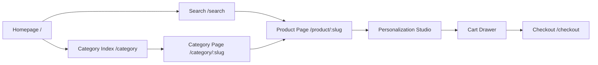
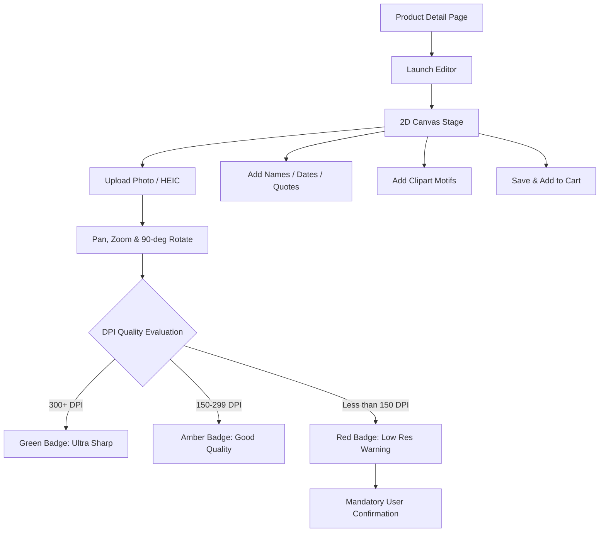
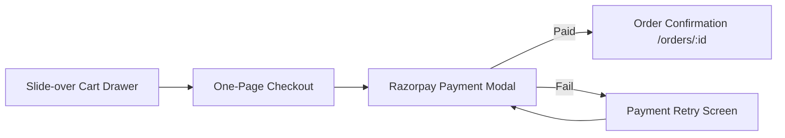
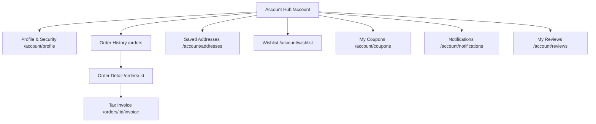
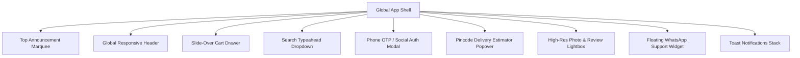

# KarthysGallery (BroPics) — Master Production UI & Page Inventory Report

> **Project:** KarthysGallery (Personalized Photo Frame E-Commerce Platform & Kavi Vazhi Photography)  
> **Target Version:** Production Master Release (1.1)  
> **Last Updated:** October 2026  
> **Document Purpose:** Complete, exhaustive inventory and UI/UX blueprint of all customer-facing, account, content, and backoffice administration pages.

---

## Table of Contents
1. [Design Tokens & Theme Guidelines](#1-design-tokens--theme-guidelines)
2. [Customer Storefront & Product Discovery](#2-customer-storefront--product-discovery)
3. [Personalization Studio & Visual Editor](#3-personalization-studio--visual-editor)
4. [Shopping Cart & Checkout Funnel](#4-shopping-cart--checkout-funnel)
5. [Customer Account Portal](#5-customer-account-portal)
6. [Brand Content, Educational & Legal Pages](#6-brand-content-educational--legal-pages)
7. [Backoffice, Production & Administration Suite](#7-backoffice-production--administration-suite)
8. [Global UI Overlays, Drawers & Modals](#8-global-ui-overlays-drawers--modals)
9. [Master Page Inventory & Route Matrix](#9-master-page-inventory--route-matrix)

---

## 1. Design Tokens & Theme Guidelines

All UI mockups, components, and pages across both the Storefront and Backoffice follow the **"Black & Gold Elegance"** design system:

### 1.1. Color Palette
| Token Name | Hex Value | Semantic Application |
|---|---|---|
| `ink` | `#000000` | Primary headings, high-contrast body copy, solid icons |
| `paper` | `#FFFFFF` | Card surfaces, modal backgrounds, canvas backdrop |
| `field` | `#FAF8F4` | Warm alabaster page background |
| `tint` | `#EFEBE4` | Image card containers, search field fills, quiet section bands |
| `line` | `#E0DAD1` | Crisp borders, dividers, card outlines |
| `gold` | `#FCA311` | Primary CTA buttons, highlight badges, promotional accents |
| `gold-deep` | `#E08F00` | CTA button hover / active pressed states |
| `accent` | `#14213D` | Prussian blue hyperlinks, dark button surfaces, nav accents |
| `accent-dark` | `#0B1428` | Accent hover state, footer and dark bar backgrounds |
| `alert` | `#A35A08` | Error messages, low-DPI warnings, validation alerts (no raw red) |

### 1.2. Typography & Layout Tokens
* **Display / Headlines:** `Outfit` (`font-display`) — geometric, modern, premium.
* **Body / UI Elements:** `Manrope` (`font-sans`) — highly legible neutral grotesque.
* **Special Small UI Size:** `2xs` (`0.6875rem / 1rem`) — review counts, timestamps, legal micro-copy.
* **Max Page Width:** `max-w-shell` (`1280px`).

---

## 2. Customer Storefront & Product Discovery

High-converting, responsive shopping and discovery views.

### 2.1. Homepage (`/`)
* **Route:** `/`
* **Access:** Public / Guest / Customer
* **Core Purpose:** Brand introduction, social proof, showcase of framing craft, and instant personalization entry points.
* **Key UI Sections & Components:**
  1. **Announcement Bar:** Sticky top banner with active coupons (`FIRSTFRAME`), free shipping threshold counter, and dispatch updates.
  2. **Global Header Navigation:** Logo, live category navigation links, search bar trigger, delivery pincode selector, notification bell, wishlist counter, and cart drawer trigger.
  3. **Hero Slider & Video Reel:** Dynamic carousel supporting desktop banners and art-directed mobile hero images, headlines, sub-headlines, badges, and "Customize Yours" primary CTAs.
  4. **Category Showcase Grid:** Visual collection tiles (Canvas Frames, Wooden Classics, Collage Frames, Acrylic & Minimalist).
  5. **Interactive Personalization Teaser:** Instant mini-demo showcasing photo upload $\rightarrow$ live frame preview in seconds.
  6. **Best Sellers & Trending Products Rail:** Product cards with price tags, discount badges, review ratings, and direct "Personalize Now" buttons.
  7. **"Why BroPics" Value Props:** 300+ DPI sharp archival printing, imported solid wood mouldings, shatterproof plexiglass, 100% damage-free transit guarantee.
  8. **How It Works (3-Step Guide):** 1. Choose Frame $\rightarrow$ 2. Upload & Crop $\rightarrow$ 3. Delivered Ready-to-Hang.
  9. **Customer UGC Wall & Reviews:** Real delivered frame photos with verified buyer quotes and star ratings.
  10. **Closing Promotional Banner:** High-contrast CTA band driving first-order discounts.
  11. **Global Footer:** Newsletter signup, quick shop links, customer care, policy links, payment gateway badges, and copyright.

---

### 2.2. Category Directory / All Collections (`/category`)
* **Route:** `/category`
* **Access:** Public
* **Core Purpose:** High-level overview of all framing collections and styles.
* **Key UI Sections & Components:**
  * SEO headline & lead copy explaining the framing styles.
  * Large visual collection cards displaying category hero images, product counts, and starting price points.
  * Framing & size selection visual guides.

---

### 2.3. Category & Collection Listing Page (`/category/[slug]`)
* **Route:** `/category/[slug]` (e.g., `/category/wooden-frames`, `/category/collages`)
* **Access:** Public
* **Core Purpose:** Filterable product catalog for a specific collection.
* **Key UI Sections & Components:**
  * **Category Hero & Breadcrumbs:** Title, description, banner graphic, and breadcrumb path.
  * **Desktop Filter Sidebar & Mobile Bottom Sheet:**
    * Size filter ($6\times8"$, $8\times10"$, $12\times18"$, $18\times24"$, etc.).
    * Frame Colour filter (Black, Walnut, Teak, Natural Gold, Pristine White).
    * Orientation filter (Portrait, Landscape, Square).
    * Price Range slider ($₹499 - ₹4,999+$).
    * Customer Rating filter ($4\star$ and above).
    * Stock Availability filter (`In Stock only`).
  * **Sort Dropdown:** Featured, Best Selling, Price (Low to High / High to Low), Customer Rating, Newest Arrivals.
  * **Product Card Grid:** Multi-column responsive cards with image hover previews, discount tags, rating stars, price, and "Personalize Now" CTA.
  * **Pagination Controls:** Prev/Next buttons with page indicators.
  * **Empty State:** Friendly fallback when filters yield 0 results with a "Clear Filters" button.

---

### 2.4. Global Search Results Page (`/search`)
* **Route:** `/search?q={query}`
* **Access:** Public
* **Core Purpose:** Dedicated search results view with advanced filtering.
* **Key UI Sections & Components:**
  * Search query bar with clear button.
  * Matched category pills for quick contextual jump.
  * Product results grid with identical filtering and sorting controls as category pages.
  * **Zero-Results State:** "No matching frames found" with recent searches, popular search tags, and a "Recommended Best Sellers" product carousel.

---

### 2.5. Product Detail Page (PDP) (`/product/[slug]`)
* **Route:** `/product/[slug]` (e.g., `/product/classic-walnut-frame`)
* **Access:** Public
* **Core Purpose:** Product education, variant selection, and launchpad for personalization.
* **Key UI Sections & Components:**
  * **Interactive Media Gallery:** High-res zoomable product photography, room-scale mockup videos, frame corner cross-sections, and user photos.
  * **Buy Box:**
    * Product title, collection badge, aggregate star rating and review count anchor.
    * Price display: Current price, crossed-out MRP, discount badge, GST inclusion note.
    * Frame Size & Aspect Ratio selection chips.
    * Frame Colour / Moulding Material visual swatches.
    * Stock status alert (`In Stock`, `Low Stock: Only X left`, `On Backorder`).
    * Pincode delivery estimator with dispatch time estimate.
  * **Personalization Trigger Button:** High-visibility "Personalize & Preview" CTA opening the live editor.
  * **Specifications & Features Accordion:**
    * Moulding width, depth, mat board thickness, and plexiglass type.
    * Archival paper quality and fade-resistant pigment inks.
    * Shipping, safe transit packaging, and replacement policy.
    * Picture quality guide tab.
  * **Frequently Bought Together Rail:** Bundle recommendations (e.g., Frame + Hanging Kit + Desktop Easel Stand).
  * **Customer Reviews & UGC Photo Section:** Filter by star rating, "With Photos only" filter toggle, verified buyer badges, and write-a-review modal trigger.
  * **Related & Recently Viewed Rails.**

---

## 3. Personalization Studio & Visual Editor

The core interactive experience where customers customize frames in real time.

### 3.1. Personalization Editor View / Panel
* **Route / Form:** Inline responsive panel on PDP or full-screen studio (`/product/[slug]?edit={personalizationId}`)
* **Key UI Sections & Components:**
  * **2D Canvas Stage:**
    * High-definition frame moulding overlay with photorealistic mat cutouts.
    * Multi-slot layout support for collages ($1, 2, 3, 4, 6+$ photos).
    * Smooth gesture support: Drag/pan, zoom slider + mobile pinch-to-zoom, discrete $90^\circ$ rotate steps.
  * **Photo Upload Dropzone:**
    * Standard formats + native `.heic` / `.heif` Apple image support.
    * Multi-state upload indicator: Uploading $\rightarrow$ Processing & Normalizing $\rightarrow$ Ready $\rightarrow$ Error retry.
  * **Real-time DPI Quality Badge:**
    * 🟢 **Green ($\ge300$ DPI):** "Ultra Sharp Print Quality"
    * 🟡 **Amber ($150-299$ DPI):** "Good Print Quality"
    * 🔴 **Red ($<150$ DPI):** "Low Resolution Warning" — requires explicit user acknowledgment checkbox before add-to-cart.
  * **Text Zones Customization:**
    * Template-constrained text inputs (e.g., "Top Headline", "Bottom Date").
    * Curated font family picker and brand colour palette chips.
    * Character limit indicators and required field validation hints.
  * **Clipart & Decorative Motifs Picker:** Hearts, rings, floral borders, baby icons.
  * **Studio Toolbar:**
    * 50-step Undo / Redo history with keyboard shortcuts (`Ctrl+Z`, `Ctrl+Y`).
    * Reset to Original button.
    * Variant Aspect Ratio switcher with auto-refit math and DPI recalculation.
    * Fullscreen Lightbox Preview.
  * **Autosave & Draft State Recovery:** "Restore your previous design?" automatic prompt on page return.
  * **Action CTA:** "Add to Cart — ₹XXXX" or "Save Changes".

---

## 4. Shopping Cart & Checkout Funnel

Frictionless, conversion-optimized checkout experience with live status updates.

### 4.1. Slide-Over Cart Drawer (`useCart` Global Component)
* **Type:** Global slide-over overlay
* **Key UI Sections & Components:**
  * **Free Shipping Meter:** "Add ₹XXX more to unlock Free Express Delivery!" dynamic progress bar.
  * **Cart Line Items:**
    * Rendered custom frame preview thumbnail.
    * Product title, selected size, and frame colour.
    * Custom text snippet and slot count.
    * Quantity stepper (+ / - / delete).
    * Real-time line total.
    * **"Edit Customization" link:** Reopens editor with uploaded photos and transforms intact.
  * **Cart Summary:** Subtotal, shipping note, and sticky "Proceed to Checkout" CTA.
  * **Empty State:** "Your cart is empty" with links to trending collections.

### 4.2. Dedicated Cart Page (`/cart`)
* **Route:** `/cart`
* **Key UI Sections & Components:** Full-width desktop cart table, promo coupon input box, and accessory upsell rails (Hanging hardware, cleaning kits).

### 4.3. One-Page Checkout (`/checkout`)
* **Route:** `/checkout`
* **Key UI Sections & Components:**
  * **Customer Contact Block:** Email and phone number with instant OTP login or guest checkout.
  * **Delivery Address Selector / Form:** Saved address selector for logged-in users; new address form with pincode auto-lookup for city and state.
  * **Shipping Method Selector:** Standard Delivery (Free / ₹XX) vs Express Dispatch (₹XX).
  * **Order Summary Column:** Compact list of customized items, variant badges, and rendered thumbnails.
  * **Coupon / Voucher Block:** Coupon code input, apply button, active coupon chip with savings callout.
  * **Price Breakdown Summary:**
    * Items Subtotal
    * Delivery Fee
    * Coupon Discount (highlighted in gold)
    * Total Payable (inclusive of all taxes)
  * **Payment CTA & Trust Badges:** "Pay with Razorpay" button, duplicate-click lock, SSL security badge, UPI / Card logos.

### 4.4. Payment Processing & Gateway Overlay
* **Type:** Integrated Razorpay Modal
* **Supported Methods:** UPI (GPay, PhonePe, Paytm, QR), Credit/Debit Cards, NetBanking, and Wallets.

### 4.5. Order Confirmation & Live Tracking (`/orders/[orderId]`)
* **Route:** `/orders/[orderId]` (Immediate post-checkout success screen)
* **Key UI Sections & Components:**
  * **Success Header:** Confetti animation, Order ID, Estimated Delivery Date.
  * **Live Order Status Stepper:**
    1. Order Confirmed & Paid
    2. Photo Validation & DPI Check
    3. Printing & Framing
    4. Quality Inspection & Packaging
    5. Dispatched (with Courier Name & live AWB Tracking URL)
    6. Delivered
  * **Ordered Items Showcase:** Preview thumbnails, custom text, frame specifications, and price.
  * **Delivery Address & Billing Summary.**
  * **Action Toolbar:**
    * 📄 **Download Tax Invoice**
    * 🔄 **Reorder Frame** (One-click re-add to cart)
    * ⚠️ **Cancel Order** (Available prior to production lock)
    * 📦 **Request Return / Replacement** (Available post-delivery)
    * 💬 **WhatsApp Order Support**

### 4.6. Payment Failure & Retry Flow
* **Type:** Error state on `/checkout` or `/orders/[orderId]`
* **Key UI Sections:** Clear explanation of failure (Bank decline, session timeout), and a "Retry Payment on Same Order" button.

---

## 5. Customer Account Portal

Self-service customer management hub.

### 5.1. Authentication Modal / Drawer
* **Type:** Global overlay dialog
* **Key UI Elements:** Phone Number input $\rightarrow$ 6-digit OTP verification, Google One-Tap sign-in, and guest-to-account profile merge.

### 5.2. Account Overview Dashboard (`/account`)
* **Route:** `/account`
* **Key UI Sections:** Profile avatar, contact summary, active orders in transit counter, quick-links navigation grid.

### 5.3. Profile & Security Settings (`/account/profile`)
* **Route:** `/account/profile`
* **Key UI Sections:** Avatar upload/crop tool, Name, Email, Phone number, Communication preference toggles (WhatsApp, SMS, Email), "Log Out All Devices", "Delete Account" modal.

### 5.4. Saved Delivery Addresses (`/account/addresses`)
* **Route:** `/account/addresses`
* **Key UI Sections:** Address cards list with "Default" tag, Add/Edit Address modal, Delete confirmation dialog.

### 5.5. Order History (`/orders`)
* **Route:** `/orders`
* **Key UI Sections:** Filter tabs (All, In Transit, Delivered, Cancelled), order summary cards, quick "Track Order" and "Reorder" actions.

### 5.6. Digital GST Tax Invoice (`/orders/[orderId]/invoice`)
* **Route:** `/orders/[orderId]/invoice`
* **Key UI Sections:** Print-optimized GST tax invoice, Seller GSTIN, customer details, HSN codes, taxable value, CGST/SGST/IGST breakdown, and "Print / Save PDF" button.

### 5.7. Return & Replacement Claim Screen
* **Type:** Modal on `/orders/[orderId]`
* **Key UI Sections:** Return reason dropdown, Resolution preference toggle (**Replacement Frame** vs **Refund**), Description box, **Mandatory Evidence Photo Uploader** for damage claims.

### 5.8. Wishlist & Saved Frame Designs (`/account/wishlist`)
* **Route:** `/account/wishlist`
* **Key UI Sections:** Grid of favourited products and custom designs with "Move to Cart" button.

### 5.9. Available Coupons & Offers (`/account/coupons`)
* **Route:** `/account/coupons`
* **Key UI Sections:** Active discount voucher cards with expiry dates, minimum spend requirements, and one-click "Copy Code" buttons.

### 5.10. My Reviews (`/account/reviews`)
* **Route:** `/account/reviews`
* **Key UI Sections:** "Pending Review" prompts for delivered frames + list of submitted reviews with photos.

### 5.11. Notifications Center (`/account/notifications`)
* **Route:** `/account/notifications`
* **Key UI Sections:** Filterable notification feed (Order status alerts, Promo drops) with unread counters.

### 5.12. Payment Methods Info (`/account/payment-methods`)
* **Route:** `/account/payment-methods`
* **Key UI Sections:** Informational guide on saved payment methods and Razorpay vault security.

---

## 6. Brand Content, Educational & Legal Pages

9 CMS-driven static pages ensuring full policy compliance and customer guidance.

| Page / Route | Primary Purpose & Key UI Components |
|---|---|
| **About Us** (`/about`) | Story of BroPics & Kavi Vazhi Photography, founder vision, workshop photo gallery, craftsmanship standards. |
| **How It Works** (`/how-it-works`) | 3-step visual framing process, photo upload walkthrough, precision printing, doorstep delivery. |
| **Picture Quality & DPI Guide** (`/picture-quality-guide`) | 300 DPI vs 150 DPI vs low-res comparisons, smartphone camera tips, uncompressed photo sharing guide. |
| **Contact Us** (`/contact`) | Direct WhatsApp chat button, customer support email, phone number, operating hours, inquiry form. |
| **FAQ / Help Center** (`/faq`) | Searchable accordion FAQs: Orders, DPI & Photos, Shipping, Returns & Damaged Goods, Corporate Orders. |
| **Shipping Policy** (`/shipping-policy`) | Dispatch SLAs, courier partners (Bluedart, Delhivery), express options, damage insurance terms. |
| **Return & Refund Policy** (`/return-refund-policy`) | 7-day personalized goods policy, damaged frame replacement criteria, evidence requirements, refund timeline. |
| **Terms of Service** (`/terms`) | Platform terms, customer uploaded image rights, payment terms, warranties. |
| **Privacy Policy** (`/privacy`) | Data protection, image retention lifecycle (auto-cleanup of raw uploads), cookie guidelines. |
| **404 Not Found** (`/not-found`) | Custom illustration, search input, and links to popular frame categories. |
| **500 Server Error** (`/error`) | Error boundary with reload button, error reference ID, and WhatsApp support link. |

---

## 7. Backoffice, Production & Administration Suite

The complete operations suite for management, workshop technicians, support, and finance.

```mermaid
flowchart TD
    Admin[Admin Shell /admin] --> Dash[Analytics Dashboard]
    Admin --> Catalog[Catalogue & Products]
    Admin --> OrdersGroup[Orders & Fulfillment]
    Admin --> Marketing[Marketing & CMS]
    Admin --> System[Settings & Team]

    Catalog --> PTable[Products Table /admin/products]
    Catalog --> PEdit[Product & Variant Matrix /admin/products/:id]
    Catalog --> TBuilder[Template Builder /admin/products/:id/template]
    Catalog --> Media[Media Library /admin/media]
    Catalog --> Cats[Categories /admin/categories]

    OrdersGroup --> OList[Orders Pipeline /admin/orders]
    OrdersGroup --> ODetail[Order Detail & Actions /admin/orders/:id]
    OrdersGroup --> PhotoVal[Photo Validation Queue]
    OrdersGroup --> ProdQ[Production & Print Queue /admin/production]
    OrdersGroup --> QC[Quality Check Console /admin/production/qc]
    OrdersGroup --> Ret[Returns & Refunds /admin/returns]

    Marketing --> HomeCMS[Homepage Builder /admin/homepage]
    Marketing --> CouponsMgt[Coupon Engine /admin/marketing/coupons]
    Marketing --> RevMod[Review Moderation /admin/reviews]
    Marketing --> CMSPages[Content CMS /admin/content/pages]

    System --> StoreSet[Store & Shipping Settings /admin/settings]
    System --> TeamMgt[Staff Roles & Access /admin/settings/team]
    System --> CustCRM[Customer Directory /admin/customers]
```

### 7.1. Admin Global Shell & Navigation
* **Route:** `/admin/*`
* **Components:**
  * **Collapsible Grouped Sidebar:**
    * 📊 **Dashboard** (`/admin`)
    * 🛍️ **Catalogue** (Products, Variants, Categories, Collections, Frame Templates, Media Library, Stock)
    * 📦 **Orders & Production** (All Orders, Photo Validation, Print Queue, QC & Packing, Shipping Dispatch, Returns & Refunds)
    * 👥 **Customers** (Directory, Customer CRM Profiles)
    * 📣 **Marketing & CMS** (Homepage Builder, Banners & Announcements, Coupons, Videos, Reviews Moderation, Content CMS, FAQs)
    * 📈 **Analytics** (Sales, Products, Personalization Funnel, Ops SLA)
    * ⚙️ **Settings** (Store, Shipping, Tax/GST, Payments, Notifications, Team & Roles)
  * **Top Bar:** Quick global search (`/` shortcut) for Orders, SKUs, or Customers; environment pill (`LIVE` / `STAGING`); staff profile menu.

---

### 7.2. Admin Analytics Dashboard (`/admin`)
* **Route:** `/admin`
* **Access:** Superadmin / Admin / Finance
* **Key UI Sections & Components:**
  * **Live KPI Metric Cards:** Today's Revenue, Total Orders, Average Order Value (AOV), Pending Payments.
  * **Operational Alert Bar:** Red-DPI orders pending review, failed print renders, orders awaiting QC, pending reviews.
  * **Revenue Trend Chart:** 30-day interactive curve comparing against prior period.
  * **Order Pipeline Funnel:** Real-time counts across: Paid $\rightarrow$ Rendering $\rightarrow$ Print Ready $\rightarrow$ In Production $\rightarrow$ QC Passed $\rightarrow$ Shipped.
  * **Top Selling Frame Products & Sizes Table.**

---

### 7.3. Products Management Table (`/admin/products`)
* **Route:** `/admin/products`
* **Access:** Admin / Staff
* **Key UI Sections & Components:**
  * Server-paginated DataTable with multi-column sorting and filtering (Status: Active, Draft, Archived; Category).
  * Bulk actions: Bulk Publish, Bulk Archive, Bulk Price Change.
  * Columns: Thumbnail, Title, SKU, Category, Base Price, Variant count, Stock status, Action buttons.
  * "Add New Product" primary button.

---

### 7.4. Product & Variant Matrix Editor (`/admin/products/[id]`)
* **Route:** `/admin/products/[id]` or `/admin/products/new`
* **Access:** Admin / Staff
* **Key UI Sections & Components:**
  * **Tabbed Navigation:** General, Pricing & Matrix, Media, Personalization, Delivery, SEO, Recommendations, Publishing History.
  * **General Tab:** Title, Slug, Description (rich text), Category, Material, Moulding specifications.
  * **2D Variant Matrix Grid:**
    * Size rows ($6\times8"$, $8\times10"$, $12\times18"$, etc.) $\times$ Colour columns (Black, Walnut, Teak, Gold, White).
    * Cell Drawer: SKU, Regular Price, Compare-at Price, Stock Status (`in_stock`, `low_stock`, `backorder`, `out_of_stock`), Min Resolution threshold.
    * Bulk Price Modifier across entire rows/columns.
  * **Media Tab:** Media library picker, upload dropzone, drag-and-drop sort, mandatory alt-text, video attachments.
  * **Personalization Tab:** Personalization toggle, Frame Template version selector, text zones enablement.
  * **Delivery Tab:** Dispatch timeline (min/max days).
  * **SEO Tab:** Meta title (60 char limit), meta description (160 char limit), OG preview.
  * **Publishing Guard:** Draft / Published / Archived toggle, Save Changes bar with unsaved dirty-state warning.

---

### 7.5. Visual Frame Template Builder (`/admin/products/[id]/template`)
* **Route:** `/admin/products/[id]/template`
* **Access:** Admin / Creative Director
* **Key UI Sections & Components:**
  * **Interactive Canvas Stage:** Upload high-res frame mockup image and visually draw photo slot bounding boxes.
  * **Slot Precision Controls:** Drag-to-resize slots with exact millimeter ($mm$) and pixel ($px$) coordinate inputs.
  * **Multi-Slot Layout:** Assign slot indices, aspect ratios, mask PNGs, and overlay PNGs.
  * **Text Zones Setup:** Define custom text bounding boxes, font size constraints ($min/max$), allowed font keys, and color palettes.
  * **Clipart / Motifs Pack Assignment.**
  * **Version Control:** Create immutable versions (`v1`, `v2`, `v3`), activate/deactivate versions, view audit log.

---

### 7.6. Template Test Render & DPI Simulator (`/admin/templates/test-render`)
* **Route:** `/admin/templates/test-render`
* **Access:** Admin / Production
* **Key UI Sections & Components:**
  * Test render tool: Upload sample test photos, input text lines, trigger the backend Sharp rendering engine.
  * Downloads the full 300 DPI composite print file for physical test printing and quality validation.

---

### 7.7. Categories & Taxonomies Manager (`/admin/categories`)
* **Route:** `/admin/categories`
* **Access:** Admin
* **Key UI Sections & Components:**
  * Drag-and-drop category tree hierarchy.
  * Category editor modal: Name, Slug, Hero Banner Image, Description, Sort Order, Active Status, SEO metadata.

---

### 7.8. Curated Collections & Inventory (`/admin/collections` & `/admin/inventory`)
* **Route:** `/admin/collections` and `/admin/inventory`
* **Access:** Admin / Production
* **Key UI Sections & Components:**
  * Curated tag groupings (e.g., "Wedding Gifts", "Minimalist Living Room").
  * Global stock status table with bulk in-stock / out-of-stock toggles.

---

### 7.9. Centralized Media Library (`/admin/media`)
* **Route:** `/admin/media`
* **Access:** Staff / Admin
* **Key UI Sections & Components:**
  * Asset vault for frame mockups, textures, masks, and marketing banners.
  * Filters by file type (Image, Video, Mask, Template Overlay).
  * Usage tracking (warns if an image is in use by an active product before deleting).
  * Direct signed file uploader.

---

### 7.10. Orders Master Pipeline Table (`/admin/orders`)
* **Route:** `/admin/orders`
* **Access:** Staff / Admin / Production
* **Key UI Sections & Components:**
  * **Status Filter Tabs:** All, Paid, Photo Validation, Rendering, Print Ready, In Production, QC Passed, Shipped, Delivered, Cancelled.
  * **Search & Filters:** Search by Order ID, Customer Name, Phone, Email; Date Range picker; Payment Method filter.
  * **DataTable:** Order ID, Date, Customer info, Rendered thumbnails, Frame specs, Total Amount, Payment Status, Status Chip, Quick Actions.
  * **Bulk Operations:** Bulk Advance Status, Bulk Export CSV, Bulk Print Packing Slips.

---

### 7.11. Admin Order Detail & Fulfillment Console (`/admin/orders/[id]`)
* **Route:** `/admin/orders/[id]`
* **Access:** Staff / Admin / Production
* **Key UI Sections & Components:**
  * **Customer & Payment Panel:** Customer profile link, shipping address, Razorpay payment ID, transaction log.
  * **Customized Items Inspector:**
    * Rendered frame preview.
    * Calculated effective DPI per photo slot.
    * ⬇️ **Download Original Customer Upload (High-Res)**
    * ⬇️ **Download 300 DPI Print-Ready Composite File**
    * 🔄 **Re-render Print File** action button (triggers Cloud Run print-render service).
  * **Shipping & Fulfillment Box:** Status advance dropdown, Courier selector (Bluedart, Delhivery, DTDC, India Post) + AWB Tracking Number entry $\rightarrow$ sends tracking link to customer.
  * **Internal Staff Notes & Activity Log:** Timestamped audit trail.
  * **Refund / Cancel Modal:** Full or partial refund trigger via Razorpay API.

---

### 7.12. Photo Validation Queue (`/admin/orders/photo-validation`)
* **Route:** `/admin/orders/photo-validation`
* **Access:** Production Staff / Admin
* **Key UI Sections & Components:**
  * Dedicated queue for orders with Red-tier DPI or aspect ratio warnings.
  * High-res zoom inspection lightbox.
  * Actions: "Approve for Production", "Request High-Res Photo from Customer" (automated WhatsApp/Email link), or "Hold Order".

---

### 7.13. Production & Print Fulfillment Queue (`/admin/production`)
* **Route:** `/admin/production`
* **Access:** Workshop Technicians / Framers
* **Key UI Sections & Components:**
  * **Production Stage Columns:** Print Queue $\rightarrow$ In Printing $\rightarrow$ Frame Assembly $\rightarrow$ QC Station.
  * **Print Item Card:** High-res preview, exact print dimensions ($W \times H$ in $mm$), paper type (Matte / Gloss), frame moulding SKU, quantity, priority badge.
  * **Batch Actions:** "Download Selected Print Files (.ZIP)", "Print Job Sheets / Barcode Slips".

---

### 7.14. Quality Check (QC) & Packing Terminal (`/admin/production/qc`)
* **Route:** `/admin/production/qc`
* **Access:** Workshop Packing Staff
* **Key UI Sections & Components:**
  * Barcode scanner input.
  * Interactive QC Checklist:
    * [ ] Print colour & sharpness verified
    * [ ] Glass / Acrylic free of scratches and dust
    * [ ] Frame corners joined securely
    * [ ] Hanging hardware & back stand installed
    * [ ] Protective corner cushions and bubble wrap applied
  * **PASS $\rightarrow$ Advance to Packed & Ready for Dispatch**
  * **FAIL $\rightarrow$ Send to Rework Queue** (with mandatory defect photo and notes: scratch, colour cast, misaligned mat).

---

### 7.15. Shipping & Dispatch Center (`/admin/shipping`)
* **Route:** `/admin/shipping`
* **Access:** Fulfillment Staff
* **Key UI Sections & Components:**
  * Manifest creation for daily courier pickup.
  * Bulk AWB assignment and shipping label generator.

---

### 7.16. Returns & Damage Claims Console (`/admin/returns`)
* **Route:** `/admin/returns`
* **Access:** Support / Admin
* **Key UI Sections & Components:**
  * Claims table (Pending Review, Approved, Replacement In Production, Refunded, Rejected).
  * **Damage Evidence Inspector:** High-res customer damage photo viewer with zoom inspection.
  * **Claim Actions:**
    * Issue Immediate Replacement (creates linked zero-cost production order).
    * Issue Razorpay Refund (triggers instant API refund).
    * Reject Claim (requires written explanation sent to customer).

---

### 7.17. Refund Management & Calculator (`/admin/returns/refunds`)
* **Route:** Modal / Route on `/admin/returns` or `/admin/orders/[id]`
* **Access:** Finance / Superadmin
* **Key UI Sections & Components:**
  * Typed confirmation dialog with maximum refundable amount guardrail.
  * Instant Razorpay refund initiation with gateway transaction receipt.

---

### 7.18. Customer Reviews & UGC Moderation (`/admin/reviews`)
* **Route:** `/admin/reviews`
* **Access:** Moderator / Admin
* **Key UI Sections & Components:**
  * Moderation table of submitted customer reviews.
  * Review card: Rating, customer name, linked product, review text, customer photo attachments, verified purchase badge.
  * Moderation Actions: **Approve**, **Reject**, **Mark as Featured** (pins to homepage UGC section), and **Add Staff Response**.

---

### 7.19. Customer Directory & CRM Profiles (`/admin/customers` & `/admin/customers/[id]`)
* **Route:** `/admin/customers` and `/admin/customers/[id]`
* **Access:** Support / Admin
* **Key UI Sections & Components:**
  * Searchable customer directory (Name, Phone, Email, Lifetime Spend, Total Orders, Registration Date).
  * Customer Profile View: Order history, saved addresses, uploaded photos & designs, assigned coupons, account status (Active / Disabled).

---

### 7.20. Homepage CMS Builder (`/admin/homepage`)
* **Route:** `/admin/homepage`
* **Access:** Admin / Marketing
* **Key UI Sections & Components:**
  * Drag-and-drop section reordering (Hero Slider, Categories, Best Sellers, Video Reel, Trust Points, Testimonials, Promo Banners).
  * Per-section form editor: Enable/disable toggle, date schedule (`startsAt` / `endsAt`), headline copy, desktop image, mobile image, CTA link.
  * Live storefront preview drawer.

---

### 7.21. Banners & Announcement Bar Manager (`/admin/marketing/banners`)
* **Route:** `/admin/marketing/banners`
* **Access:** Admin / Marketing
* **Key UI Sections & Components:**
  * Top marquee announcement bar copy, background colour, text colour, and promo code link.
  * Promotional popup modal builder (exit-intent or timer-based).

---

### 7.22. Coupon & Discount Engine (`/admin/marketing/coupons`)
* **Route:** `/admin/marketing/coupons`
* **Access:** Admin / Marketing
* **Key UI Sections & Components:**
  * Coupon list with performance metrics (Total redemptions, Revenue generated).
  * Coupon Editor: Code name, Discount Type (`%` off / Flat `₹` off / Free Shipping), Value, Min Cart Subtotal, Max Discount Cap, Date range, Per-user limit, Customer targeting.

---

### 7.23. Video & Story Reel CMS (`/admin/marketing/videos`)
* **Route:** `/admin/marketing/videos`
* **Access:** Admin / Marketing
* **Key UI Sections & Components:**
  * Vertical video uploader (MP4/WebM) for workshop and styling reels.
  * Product tagging on videos (enables shoppable video popups).
  * Placement selector (Homepage Reel vs PDP Gallery).

---

### 7.24. Content CMS & Legal Pages Editor (`/admin/content/pages` & `/admin/content/faq`)
* **Route:** `/admin/content/pages` and `/admin/content/faq`
* **Access:** Admin / Support
* **Key UI Sections & Components:**
  * Rich-text WYSIWYG editor for static pages (About Us, How It Works, Policies).
  * FAQ Item Manager: Question, Answer, Category grouping, Sort order.
  * SEO metadata inputs per page.

---

### 7.25. Business Intelligence & Funnel Analytics (`/admin/analytics`)
* **Route:** `/admin/analytics`
* **Access:** Superadmin / Admin
* **Key UI Sections & Components:**
  * **Sales & Revenue Report:** Gross sales, net sales, shipping fees collected, discounts, refunds.
  * **Product Performance:** Top frame mouldings, most popular sizes, conversion rates.
  * **Personalization Funnel Analytics:** Funnel drop-off tracking (PDP View $\rightarrow$ Personalization Started $\rightarrow$ Photo Uploaded $\rightarrow$ Added to Cart $\rightarrow$ Checkout $\rightarrow$ Paid).
  * **Fulfillment SLA Tracker:** Average time from order to print, time to ship, courier delivery performance.

---

### 7.26. Store & Global Business Settings (`/admin/settings`)
* **Route:** `/admin/settings` (Sub-routes: `/store`, `/shipping`, `/tax`, `/payments`)
* **Access:** Superadmin / Admin
* **Key UI Sections & Components:**
  * **Store Settings:** Brand name, support email, WhatsApp number, workshop address, currency.
  * **Shipping Settings:** Free shipping threshold (₹999), standard shipping charge, express shipping rate, serviceable pincodes.
  * **Tax / GST Settings:** Business GSTIN, default tax rate (18%), registered state, invoice prefix series.
  * **Payment Settings:** Razorpay live/test key toggle, enabled payment methods.

---

### 7.27. Notification Templates & Logs (`/admin/settings/notifications`)
* **Route:** `/admin/settings/notifications`
* **Access:** Superadmin / Admin
* **Key UI Sections & Components:**
  * Template editor for automated Email, SMS, and WhatsApp messages: Order Confirmed, Photo Low-DPI Alert, Dispatch & Tracking Link, Delivered, Review Request.
  * Notification dispatch log with manual "Resend" trigger.

---

### 7.28. Team & Staff Role Access (`/admin/settings/team` / `/admin/roles`)
* **Route:** `/admin/settings/team` (or `/admin/roles`)
* **Access:** Superadmin
* **Key UI Sections & Components:**
  * Staff list with active status and last login.
  * Invite staff member modal.
  * 5-tier role assignment:
    1. **Superadmin:** Full unrestricted access to settings, team, financial data, and logs.
    2. **Admin:** Catalogue, Orders, Marketing, Content, Reviews, and Customer CRM.
    3. **Production Staff:** Orders, Photo Validation, Print Queue, QC, and Shipping.
    4. **Moderator:** Reviews UGC, Customer Return Claims.
    5. **Finance:** Invoices, Refunds, Revenue Analytics.
  * Revoke staff access / disable account button.

---

## 8. Global UI Overlays, Drawers & Modals

Floating elements and modal dialogs spanning the entire application:

1. **Top Announcement Bar:** Dismissible sticky promotional banner.
2. **Global Responsive Header:** Sticky nav with category links, animated search bar, delivery location selector, notification badge, wishlist counter, and cart trigger with count.
3. **Slide-Over Cart Drawer:** Quick view of cart items with real-time free shipping threshold meter.
4. **Search Typeahead Overlay:** Keyboard-navigable autocomplete with product thumbnails and popular search chips.
5. **Mobile Bottom Sheet Filter:** Fixed-overlay sliding filter tray on mobile category and search views.
6. **Authentication & OTP Modal:** Phone number OTP verification and Google sign-in dialog.
7. **Pincode Delivery Estimator Popover:** Instant postal code verification with courier dispatch dates.
8. **High-Res Photo Lightbox:** Zoomable inspection view for PDP gallery, UGC reviews, and template preview.
9. **Floating WhatsApp Support Widget:** Quick-connect customer service button with pre-filled inquiry text.
10. **Toast Notification System:** Global alerts for cart additions, wishlist updates, and clipboard copies.

---

## 9. Master Page Inventory & Route Matrix

| # | Page / Screen Name | Route Path | Access Tier | Core UI Components | Implementation Status |
|---|---|---|---|---|---|
| **1** | **Homepage** | `/` | Public / Guest | Hero Slider, Collections Grid, Best Sellers Rail, Why Us, How It Works, UGC Wall, Footer | Built (CMS-wired) |
| **2** | **Category Index** | `/category` | Public / Guest | Collections Grid, Framing Guides, SEO copy | Built |
| **3** | **Category / Collection Page** | `/category/[slug]` | Public / Guest | Filter Sidebar / Bottom Sheet, Sort Dropdown, Product Grid, Pagination, Category Hero | Built |
| **4** | **Global Search Results** | `/search` | Public / Guest | Typeahead Dropdown, Category Pills, Filter Sidebar, Product Grid, Empty State Recommendations | Built |
| **5** | **Product Detail Page (PDP)** | `/product/[slug]` | Public / Guest | GalleryStrip (Image+Video), Buy Box, Variant Pills, Swatches, FAQ, Reviews, Related Products | Built |
| **6** | **Personalization Studio** | Inline / Modal (`?edit=...`) | Public / Guest | 2D Canvas Stage, Crop, Pan, Zoom, $90^\circ$ Rotate, Text Zones, DPI Badge, Autosave | Built |
| **7** | **Slide-Over Cart Drawer** | Global Overlay (`useCart`) | Public / User | Customized Thumbnails, Free Shipping Meter, Quantity Steppers, Re-edit link, Checkout CTA | Built |
| **8** | **Dedicated Cart Page** | `/cart` | Public / User | Full Cart Table, Promo Code Input, Accessories Cross-sell | Built |
| **9** | **Checkout Page** | `/checkout` | Guest / User | Address Form, Delivery Options, Coupon Module, Price Breakdown, Razorpay Trigger | Built |
| **10** | **Order Confirmation & Tracking** | `/orders/[orderId]` | Customer (Owner) | Live Timeline Stepper, Customized Previews, Tracking URL, Reorder, Return Trigger | Built |
| **11** | **Printable Tax Invoice** | `/orders/[orderId]/invoice` | Customer (Owner) | Print-optimized GST Tax Invoice, HSN Breakdown, Print-to-PDF | Built |
| **12** | **Account Overview** | `/account` | Authenticated User | User Banner, Quick Stats, Recent Orders, Account Nav Grid | Built |
| **13** | **Profile & Security** | `/account/profile` | Authenticated User | Avatar Upload, Contact Form, Notification Toggles, Logout All Devices, Delete Account | Built |
| **14** | **Saved Addresses** | `/account/addresses` | Authenticated User | Address Cards List, Add/Edit Address Modal, Default Badge | Built |
| **15** | **Order History** | `/orders` | Authenticated User | Tabbed Order List, Status Chips, Track Links | Built |
| **16** | **Wishlist** | `/account/wishlist` | Authenticated User | Saved Frame Designs Grid, Move to Cart CTA | Built |
| **17** | **Coupons & Offers** | `/account/coupons` | Authenticated User | Active Voucher Cards, One-click Copy Code | Built |
| **18** | **My Reviews** | `/account/reviews` | Authenticated User | Pending Review Prompts, Submitted Reviews with Photos | Built |
| **19** | **In-App Notifications** | `/account/notifications` | Authenticated User | Notification Feed, Unread Badges, Mark as Read | Built |
| **20** | **Payment Methods Info** | `/account/payment-methods` | Authenticated User | Razorpay Vault & Payment Security FAQ | Built |
| **21** | **About Us** | `/about` | Public | Brand Story, Photography Heritage, Workshop Gallery | Built (CMS-ready) |
| **22** | **How It Works** | `/how-it-works` | Public | Visual 3-Step Process Guide, Video Explainer | Built (CMS-ready) |
| **23** | **Picture Quality & DPI Guide** | `/picture-quality-guide` | Public | 300 DPI vs 150 DPI Visuals, Photo Tips, Uncompressed Upload Guide | Built |
| **24** | **Contact Us** | `/contact` | Public | WhatsApp Direct Button, Support Form, Phone, Email | Built (CMS-ready) |
| **25** | **FAQ & Help Center** | `/faq` | Public | Categorized Accordion FAQs, Search Filter | Built (CMS-ready) |
| **26** | **Shipping Policy** | `/shipping-policy` | Public | Dispatch Timelines, Courier Partners, Coverage | Built (CMS-ready) |
| **27** | **Return & Refund Policy** | `/return-refund-policy` | Public | Return Guidelines, Damage Claim Procedure | Built (CMS-ready) |
| **28** | **Terms of Service** | `/terms` | Public | Legal Terms, Content Guidelines, Warranties | Built (CMS-ready) |
| **29** | **Privacy Policy** | `/privacy` | Public | Data Protection, Image Retention Lifecycles | Built (CMS-ready) |
| **30** | **404 Not Found** | `/not-found` | Public | Custom Illustrated 404, Quick Navigation Links | Built |
| **31** | **500 Server Error** | `/error` | Public | Error Boundary, Reload Action, WhatsApp Link | Built |
| **32** | **Admin Dashboard** | `/admin` | Staff / Admin | Live KPI Cards, Revenue Curve, Operational Alerts, Pipeline Funnel | Master Plan (To Wire) |
| **33** | **Admin Products Table** | `/admin/products` | Staff / Admin | DataTable, Multi-column Filters, Bulk Publish/Archive | Built (To Wire API) |
| **34** | **Product & Variant Matrix Editor** | `/admin/products/[id]` | Staff / Admin | Variant Matrix (Size $\times$ Colour), Media, Personalization, SEO, Save Guard | Built (To Wire API) |
| **35** | **Visual Frame Template Builder** | `/admin/products/[id]/template` | Admin / Designer | 2D Canvas Slot Drawer, Numeric $mm$ Inputs, Text Zones, Version Manager | Built (To Wire API) |
| **36** | **Template Test Render Tool** | `/admin/templates/test-render` | Staff / Admin | Sample Photo Upload, Sharp 300 DPI File Renderer | Master Plan (To Build) |
| **37** | **Categories Manager** | `/admin/categories` | Admin | Hierarchy Tree, Reorder, Image, SEO | Built (To Wire API) |
| **38** | **Collections & Inventory** | `/admin/collections` | Admin | Curated Collections, Stock Status Controller | Master Plan (To Build) |
| **39** | **Media Library** | `/admin/media` | Staff / Admin | Asset Vault, In-Use References, Direct Uploader | Master Plan (To Build) |
| **40** | **Admin Orders Pipeline** | `/admin/orders` | Staff / Admin | Status Tabs, Courier/AWB Assignment, CSV Export, Shared Status Chips | Built (Full API) |
| **41** | **Admin Order Detail & Console** | `/admin/orders/[id]` | Staff / Admin | Customer Info, High-Res / Print Downloads, Re-render, Refund Trigger | Master Plan (To Build) |
| **42** | **Photo Validation Queue** | `/admin/orders/photo-validation` | Staff / Production | Low-DPI Inspector, Request High-Res Action, Approval | Master Plan (To Build) |
| **43** | **Production & Print Queue** | `/admin/production` | Production Staff | Print Dimensions, Paper Types, Batch ZIP Download, Job Sheets | Master Plan (To Build) |
| **44** | **QC & Packing Console** | `/admin/production/qc` | Workshop Staff | Barcode Scan, Inspection Checklist, Pass/Rework | Master Plan (To Build) |
| **45** | **Shipping & Dispatch Center** | `/admin/shipping` | Fulfillment Staff | Courier Dropdowns, Bulk AWB Entry, Shipping Labels | Master Plan (To Build) |
| **46** | **Returns & Claims Console** | `/admin/returns` | Admin / Support | Customer Damage Photo Inspector, Replacement / Refund Actions | Built (Full API) |
| **47** | **Refund Management Modal** | `/admin/returns/refunds` | Finance / Admin | Typed Amount Calculator, Razorpay Reversals | Master Plan (To Build) |
| **48** | **Reviews Moderation** | `/admin/reviews` | Moderator / Admin | Customer UGC Photo Inspection, Approve / Reject, Feature Pin | Built (Full API) |
| **49** | **Customer Directory & CRM** | `/admin/customers` | Admin / Support | Customer Table, Lifetime Value, Order History, Disable Account | Master Plan (To Build) |
| **50** | **Homepage CMS Builder** | `/admin/homepage` | Admin / Marketing | Section Reordering, Per-type Editors, Art-directed Mobile Images, Schedule | Built (To Wire API) |
| **51** | **Banners & Announcements** | `/admin/marketing/banners` | Admin / Marketing | Marquee Banner Editor, Popup Promo Dialogs | Master Plan (To Build) |
| **52** | **Coupon & Promotion Engine** | `/admin/marketing/coupons` | Admin / Marketing | Discount Rules (% / Flat / Free Ship), User Caps, Analytics | Master Plan (To Build) |
| **53** | **Video Reel Manager** | `/admin/marketing/videos` | Admin / Marketing | Vertical Video Uploads, Product Tagging | Master Plan (To Build) |
| **54** | **Content Pages CMS** | `/admin/content/pages` | Admin / Marketing | Rich Text WYSIWYG Editor for Static Pages | Master Plan (To Build) |
| **55** | **FAQ CMS** | `/admin/content/faq` | Admin / Support | FAQ Creator, Category Sorter | Master Plan (To Build) |
| **56** | **Analytics & Intelligence** | `/admin/analytics` | Superadmin / Admin | Sales Curves, Personalization Drop-off Funnel, SLA Reports | Master Plan (To Build) |
| **57** | **Store & System Settings** | `/admin/settings` | Superadmin / Admin | Store Info, Shipping Rates, Tax / GSTIN, Razorpay Config | Master Plan (To Build) |
| **58** | **Notification Templates** | `/admin/settings/notifications` | Superadmin / Admin | Email / WhatsApp Template Editor, Resend Logs | Master Plan (To Build) |
| **59** | **Team & Staff Access** | `/admin/settings/team` (`/admin/roles`) | Superadmin | Staff List, 5-Tier Role Picker, Invite & Revoke | Built (Full API) |

---
*Report stored at `docs/UI_PAGES_MASTER_REPORT.md` for UI/UX design blueprints and wireframing.*
