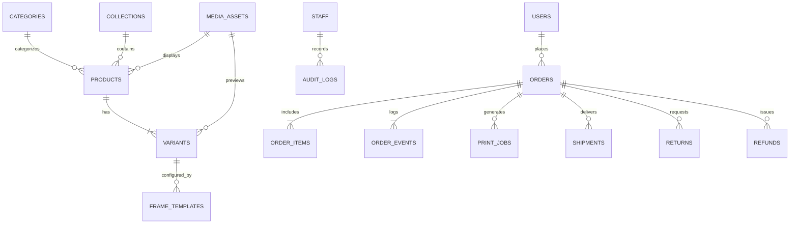
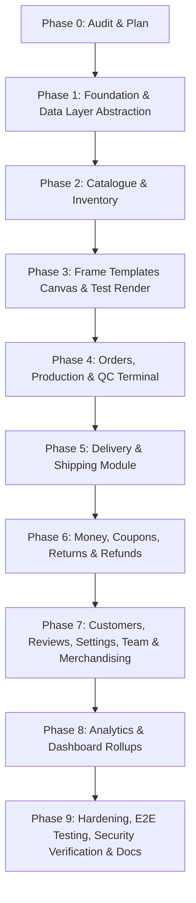

# BroPics Admin Panel: Comprehensive Architecture & Execution Plan

> **Specification & Roadmap**
> **Target System:** BroPics E-Commerce Owner Control Center (India, INR, GST)
> **Stack:** Next.js 15 App Router, React 18, Tailwind CSS, Framer Motion, TypeScript Strict, Firebase (Firestore, Storage, Auth Custom Claims, Functions v2), Cloud Run (Print-Render with Sharp), Razorpay.

---

## 1. Executive Summary & Scope

The **BroPics Admin Panel** is a dark, dense, keyboard-friendly, desktop-first (tablet-usable for workshop QC/production) control center built from scratch under `apps/web/app/admin/**` and `apps/web/app/api/admin/**`. It operates independently from the storefront, communicating exclusively through a strictly typed data abstraction layer (`AdminDataService`), centralized validation (`Zod .strict()`), role-based access control (RBAC), transactional audit logging, and precise on-demand cache invalidation.

### In-Scope Domain Modules
1. **Executive Dashboard (`/admin`)**: Daily/7d/30d financial KPIs, period-over-period comparison, actionable operational queues (low DPI photo validation, render failures, QC holds, ready to ship, returns, low stock, pending reviews), 30-day revenue charts sourced from `analyticsDaily` rollups.
2. **Product & Catalogue Management (`/admin/products`, `/admin/categories`, `/admin/collections`, `/admin/inventory`)**:
   - Full lifecycle (`draft`, `active`, `archived`) with soft-delete (`deletedAt`) and restore/purge controls.
   - Products table with server cursor pagination, status/category/stock filtering, SKU auto-generation, multi-variant matrices (Size × Frame Colour).
   - Category tree with drag-and-drop reordering (`sortOrder`).
   - Manual & automated product collections.
   - Inventory matrix with inline editing, low-stock alerts, and transactional `inventoryMovements` ledger.
3. **Media Library & Picker (`/admin/media`)**:
   - Centralized `mediaAssets` collection under `public/` storage paths with width, height, mime, size, alt text, and transactional `usageCount` tracking.
   - Reusable media picker modal with dimension/mime validation and deletion guards.
4. **Frame Templates & Personalization Canvas (`/admin/frame-templates`)**:
   - Interactive canvas slot editor (draw, drag, resize, numeric mm inputs, z-index, masks) adhering to `@bro-pics/shared` normalized coordinate math (`editor-geometry.ts`).
   - Text zones and clipart configuration.
   - Immutable version snapshotting (`isCurrent` atomic flip, pinned `templateVersion` in orders).
   - Server-side test render pipeline (300 DPI print PNG + proof thumbnail) with mandatory test-render verification before version activation.
5. **Orders & Production Workflow (`/admin/orders`, `/admin/production`)**:
   - Canonical state machine: `pending_payment` $\to$ `paid` $\to$ `payment_confirmed` $\to$ `photo_validation` $\to$ `print_rendering` $\to$ `print_ready` $\to$ `in_production` $\to$ `quality_check` $\to$ `packed` $\to$ `shipped` $\to$ `delivered` (with `cancelled`, `refunded`, `rework`, `replacement_issued` branches).
   - Order detail with 15-minute TTL secure signed asset downloads (original, 300 DPI print, proof; audit logged), inline DPI chips, status transition triggers, GST breakdown, internal notes.
   - Low-DPI Photo Validation queue with hold / request better photo (secure customer re-upload link).
   - Station Kanban board, printable job sheets with barcodes, batch ZIP export of print assets.
   - QC terminal with barcode scanning, 5-point checklist (PASS $\to$ `packed`, FAIL $\to$ `rework` with defect code and mandatory photo/note).
   - Print job monitor with DLQ visibility and retry.
6. **Delivery & Logistics (`/admin/delivery/*`)**:
   - Pincode serviceability registry (serviceable status, min/max ETA, COD availability, courier preference) with CSV bulk import/export.
   - Shipping rules engine (free shipping threshold, flat rates, weight slabs, zonal rates, express surcharge).
   - Courier registry with dynamic tracking URL templates (`{awb}`).
   - Shipment creation, bulk AWB CSV assignment, dispatch manifests, packing slip PDFs, and delivery status webhooks/manual triggers.
7. **Money, Returns & Refunds (`/admin/returns`, `/admin/coupons`)**:
   - Return requests queue with evidence photo lightbox, approve refund/replacement, rejection reason.
   - Item-level return support (`returnItems[]`) and replacement production order generator.
   - Two-step refund modal with typed confirmation (`REFUND-₹amount`), idempotency keys, max-refundable bounds, Razorpay API execution, and ledger tracking.
   - Coupons CRUD with rich rules (`percent`, `flat`, `free_shipping`, min order, max cap, date windows, usage caps, per-user limits, category/product inclusions/exclusions, first-order flag) and performance analytics.
8. **Customer Directory (`/admin/customers`)**:
   - Customer profile, order history, addresses, saved designs, coupon history, review history, lifetime value (LTV).
   - Instant account disablement with session revocation and GDPR-compliant anonymization preserving tax invoices.
9. **Reviews Moderation (`/admin/reviews`)**:
   - Queue for approve/reject/feature, verified purchase badges, staff replies, and transactional product rating aggregation.
10. **Store Settings (`/admin/settings/*`)**:
    - Singleton documents (`settings/{store|tax|shipping|payments|notifications|announcement}`).
    - GST settings (GSTIN, HSN codes, invoice prefix, inter/intra-state split).
    - Razorpay payment status with masked secrets.
    - Notification template manager with variables preview, test email/SMS/WhatsApp dispatch, and outbox logs.
11. **Team & Audit Trail (`/admin/team`, `/admin/audit`)**:
    - Staff invitations (token + expiration), 5-role RBAC assignment, instant access revocation, mandatory re-auth for role changes.
    - Append-only audit log viewer with actor, entity, action, before/after diffs (PII-masked), and CSV export.
12. **Storefront Merchandising (`/admin/merchandising`)**:
    - Minimalist screen for homepage announcement bar text/link and drag-sort reordering of `featuredOnHomepage` products and collections.

---

## 2. Repo Audit & Gap Analysis

| Area | Existing State in Monorepo | Required BroPics Admin Spec | Action Required |
| :--- | :--- | :--- | :--- |
| **Data Layer** | Ad-hoc Firestore queries across route handlers and client components. | Strict `AdminDataService` repository interface in `@bro-pics/shared` with `firestoreAdminDataService` and `mockAdminDataService`. | Create `packages/shared/src/data-service/` with full repository interface & implementations; eliminate direct Firestore calls. |
| **Catalogue Lifecycle** | Mixed `isActive: boolean` and optional `status: 'draft' \| 'published' \| 'archived'`. | Unified `status: 'draft' \| 'active' \| 'archived'` + `deletedAt: Date \| null` with soft delete, restore, and permanent purge. | Standardize schemas; synchronize `isActive = (status === 'active' && deletedAt === null)` for backward index compatibility. |
| **RBAC Roles** | 5 roles defined in `permissions.ts` (`super_admin`, `admin`, `staff`, `content_manager`, `catalogue_manager`). | Rename `content_manager` $\to$ `marketing_manager` (coupons, reviews, merchandising) with backwards compatibility; add granular permission keys (`catalogue:publish`, `catalogue:delete`, `orders:cancel`, `refunds:execute`, `audit:read`, etc.). | Updated in Phase 0; fully wire into API guards and UI `PermissionGate`. |
| **Media Registry** | Basic `MediaAssetSchema` under `public/`. | Centralized `mediaAssets` with transactional `usageCount`, batched resolution (`getManyByIds`), delete guard if `usageCount > 0`. | Implement media repository, upload endpoint, and usage tracking. |
| **Frame Templates** | Template schema present; basic mock renderer. | Real canvas editor with slot & text zone manipulation, numeric mm inputs, immutable versioning, test-render execution via Cloud Run Sharp service, activation guard. | Build full canvas UI, test-render action, and version management. |
| **Orders & Production** | Status enum defined; basic transitions. | Canonical order lifecycle, photo validation queue, Kanban production board, printable job sheets with barcodes, 5-point QC terminal, DLQ retry for print jobs. | Build production board, QC terminal, job sheets, and secure signed download links. |
| **Shipping & Logistics** | Pincode zones helper only. | First-class shipping module: serviceability table, rate rules, courier registry, shipment generation, bulk AWB CSV import, dispatch manifests. | Create shipping domain schemas, repository, APIs, and UI. |
| **Returns & Refunds** | Basic returns API and refund schema. | Full/partial refund modal with typed `REFUND-₹amount` confirm, Razorpay integration, replacement order generator, item-level returns. | Build complete refund modal, replacement order workflow, and audit ledger. |
| **Settings** | Single `settings/global` doc. | Granular singleton docs: `settings/store`, `settings/tax`, `settings/shipping`, `settings/payments`, `settings/notifications`, `settings/announcement`. | Split into typed singleton schemas with masked secret views. |
| **Cache Invalidation** | Ad-hoc `revalidatePath` in some endpoints. | Centralized `lib/admin/revalidate.ts` covering both admin and storefront routes on every mutation. | Implement centralized entity-based revalidator. |
| **UI Components** | Some basic stubs (`DataTable`, `AdminShell`). | Complete design-system compliant component kit ("Black & Gold Elegance"): `AdminShell`, `DataTable` (dense, cursor pagination, sort, bulk bar), `FormSection`, `StatusChip`, `ConfirmDialog`, `MediaPicker`, `DragList`, `PermissionGate`, Global Search (`/` key). | Complete and polish all admin components. |

---

## 3. Domain Entity & Firestore Collection Blueprint



### Collection Specifications

1. **`products` (`ProductSchema`)**:
   - `id`: string (doc ID)
   - `title`: string
   - `slug`: string (unique)
   - `categoryId`: string
   - `status`: `'draft' | 'active' | 'archived'`
   - `isActive`: boolean (`status === 'active' && deletedAt === null`)
   - `deletedAt`: Timestamp | null
   - `shortDesc`, `descriptionHtml`, `careText`: string
   - `highlights`, `howItWorks`: string[]
   - `basePrice`, `minPrice`, `maxPrice`: integer (paise)
   - `availableSizes`, `availableColours`, `availableMaterials`: string[]
   - `dispatchDaysMin`, `dispatchDaysMax`, `photoSlots`: integer
   - `allowsTextPersonalization`: boolean
   - `hsnCode`: string (GST)
   - `sortOrder`: integer
   - `ratingAverage`: number (0-5), `ratingCount`: integer, `salesCount`: integer
   - `primaryImageUrl`, `hoverImageUrl`: string
   - `mediaAssetIds`: string[]
   - `seo`: `{ title?, description? }`
   - `createdAt`, `updatedAt`: Timestamp

2. **`products/{productId}/variants` (`VariantSchema`)**:
   - `id`: string
   - `productId`: string
   - `sku`: string (unique)
   - `sizeLabel`: string (e.g., "8x12 in")
   - `widthIn`, `heightIn`: number
   - `frameColour`, `material`: string
   - `price`, `compareAtPrice`: integer (paise)
   - `stock`: integer
   - `lowStockThreshold`: integer (default 5)
   - `stockStatus`: `'in_stock' | 'out_of_stock' | 'backorder'`
   - `printWidthPx`, `printHeightPx`, `minUploadPx`: integer
   - `aspectRatio`: number
   - `isActive`: boolean
   - `deletedAt`: Timestamp | null

3. **`categories` (`CategorySchema`)**:
   - `id`, `name`, `slug`, `parentId`: string | null
   - `image`, `heroImage`, `description`: string
   - `sortOrder`: integer
   - `status`: `'draft' | 'active' | 'archived'`
   - `isActive`: boolean
   - `deletedAt`: Timestamp | null
   - `seo`: `{ title?, description? }`

4. **`collections` (`CollectionSchema`)**:
   - `id`, `name`, `slug`, `description`, `image`: string
   - `productIds`: string[]
   - `sortOrder`: integer
   - `startsAt`, `endsAt`: Timestamp | null
   - `featuredOnHomepage`: boolean
   - `status`: `'draft' | 'active' | 'archived'`
   - `isActive`: boolean
   - `deletedAt`: Timestamp | null
   - `seo`: `{ title?, description? }`

5. **`mediaAssets` (`MediaAssetSchema`)**:
   - `id`: string
   - `path`: string (must start with `public/`)
   - `type`: `'image' | 'video'`
   - `width`, `height`, `sizeBytes`: integer
   - `mime`: string
   - `alt`: string
   - `blurDataUrl`: string
   - `usageCount`: integer (transactionally tracked)
   - `usageRefs`: `{ resource: string, resourceId: string }[]`
   - `createdAt`, `updatedAt`: Timestamp

6. **`frameTemplates` (`FrameTemplateSchema`)**:
   - `id`: string
   - `variantId`: string
   - `version`: integer
   - `isCurrent`: boolean
   - `mockupUrl`, `maskUrl`, `overlayUrl`: string | null
   - `printableRects`: `{ slotIndex, x, y, width, height, widthMm, heightMm, zIndex?, maskUrl? }[]`
   - `bleedMm`, `matInset`: number
   - `textZones`: `TextZone[]`
   - `clipartOptions`: `ClipartOption[]`
   - `lastTestRender`: `{ at: Timestamp, printUrl: string, proofUrl: string, status: 'pass' | 'fail' } | null`

7. **`orders` (`OrderSchema`) & Subcollections**:
   - `id`, `orderNo`, `userId`: string
   - `status`: `OrderStatus` (canonical state machine)
   - `paymentStatus`: `'pending' | 'paid' | 'failed' | 'refunded'`
   - `subtotal`, `discount`, `shipping`, `total`: integer (paise)
   - `amountPaidOnline`, `amountDueOnDelivery`: integer
   - `couponCode`: string | null
   - `addressJson`: Address
   - `deliveryMethod`: `'standard' | 'express'`
   - `paymentMode`: `'prepaid' | 'partial_cod'`
   - `invoiceNo`: string | null
   - `taxLines`: `{ gstin?, rate, amount }[]`
   - `placedAt`, `updatedAt`: Timestamp
   - Subcollections:
     - `orders/{id}/items`: line items with variant snapshot, customization snapshot, effective DPI tier.
     - `orders/{id}/events`: append-only history of status changes and notes.
     - `orders/{id}/refunds`: ledger of processed/pending refunds.

8. **`inventoryMovements` (`InventoryMovementSchema`)**:
   - `id`: string
   - `variantId`: string
   - `sku`: string
   - `delta`: integer (positive for restock/return, negative for sale)
   - `previousStock`, `newStock`: integer
   - `reason`: `'order_placed' | 'order_cancelled' | 'return_restock' | 'manual_adjustment' | 'cycle_count' | 'damage'`
   - `orderId`: string | null
   - `actorUid`: string
   - `createdAt`: Timestamp

9. **`couriers` & `shippingServiceability`**:
   - `couriers`: `{ id, name, trackingUrlTemplate, defaultForZones: string[], isActive: boolean }`
   - `shippingServiceability`: `{ pincode, state, zone, isServiceable, etaMinDays, etaMaxDays, codAvailable, preferredCourierId }`

10. **`settings/{key}` Singletons**:
    - `settings/store`: Store name, address, contact phone, support email, social links.
    - `settings/tax`: GSTIN, legal business name, registered state, default HSN code, tax split rules.
    - `settings/shipping`: Free shipping threshold, default flat rate, express surcharge, dimensional weight divisor.
    - `settings/payments`: Razorpay key ID, webhook secret status, partial COD configurations.
    - `settings/notifications`: Channel configurations (Email, SMS, WhatsApp), provider credentials status.
    - `settings/announcement`: Text, link, active flag.

11. **`staff` & `staffInvites`**:
    - `staff/{uid}`: `{ uid, email, displayName, role: Role, disabled: boolean, createdAt, updatedAt, lastLoginAt }`
    - `staffInvites/{token}`: `{ email, role: Role, expiresAt, invitedBy, usedAt: Timestamp | null }`

12. **`auditLogs` (`AuditLogSchema`)**:
    - `id`: string
    - `actorUid`: string
    - `actorRole`: Role
    - `action`: string (e.g. `product.publish`, `refund.execute`, `order.transition`)
    - `entityType`: string
    - `entityId`: string
    - `before`: Record<string, unknown> | null (PII masked, diff only)
    - `after`: Record<string, unknown> | null (PII masked, diff only)
    - `requestId`, `ip`: string
    - `at`: Timestamp

---

## 4. RBAC & Permissions Matrix

### Roles
1. `super_admin`: Full unconditional access to all modules, team management, and dangerous operations (permanent delete).
2. `admin`: Full operational and catalog control, refunds execution, settings management (excludes `team:manage`).
3. `staff`: Workshop and fulfillment staff (orders, photo validation, production board, QC, shipping, returns handling, inventory adjustments, review moderation).
4. `catalogue_manager`: Product catalogue, variant matrices, categories, collections, frame templates, inventory.
5. `marketing_manager` *(replaces `content_manager`)*: Coupons, reviews moderation, merchandising, notification templates, announcement bar, analytics.

### Permission Mapping Table

| Permission Key | `super_admin` | `admin` | `staff` | `catalogue_manager` | `marketing_manager` |
| :--- | :---: | :---: | :---: | :---: | :---: |
| `catalogue:read` | ✅ | ✅ | ❌ | ✅ | ✅ |
| `catalogue:write` | ✅ | ✅ | ❌ | ✅ | ❌ |
| `catalogue:publish` | ✅ | ✅ | ❌ | ✅ | ❌ |
| `catalogue:delete` | ✅ | ✅ | ❌ | ✅ | ❌ |
| `inventory:write` | ✅ | ✅ | ✅ | ✅ | ❌ |
| `orders:read` | ✅ | ✅ | ✅ | ❌ | ❌ |
| `orders:write` | ✅ | ✅ | ✅ | ❌ | ❌ |
| `orders:cancel` | ✅ | ✅ | ❌ | ❌ | ❌ |
| `production:write` | ✅ | ✅ | ✅ | ❌ | ❌ |
| `shipping:write` | ✅ | ✅ | ✅ | ❌ | ❌ |
| `returns:read` | ✅ | ✅ | ✅ | ❌ | ❌ |
| `returns:write` | ✅ | ✅ | ✅ | ❌ | ❌ |
| `refunds:execute` | ✅ | ✅ | ❌ | ❌ | ❌ |
| `customers:read` | ✅ | ✅ | ✅ | ❌ | ❌ |
| `customers:write` | ✅ | ✅ | ❌ | ❌ | ❌ |
| `coupons:write` | ✅ | ✅ | ❌ | ❌ | ✅ |
| `reviews:moderate` | ✅ | ✅ | ✅ | ❌ | ✅ |
| `settings:read` | ✅ | ✅ | ❌ | ✅ | ✅ |
| `settings:write` | ✅ | ✅ | ❌ | ❌ | ✅ |
| `team:manage` | ✅ | ❌ | ❌ | ❌ | ❌ |
| `analytics:read` | ✅ | ✅ | ❌ | ❌ | ✅ |
| `audit:read` | ✅ | ✅ | ❌ | ❌ | ❌ |

---

## 5. Route Manifest & API Permissions

### Admin UI Pages (`apps/web/app/admin/**`)

| Page Route | Required Permission | Description |
| :--- | :--- | :--- |
| `/admin` | `analytics:read` / Authenticated Staff | Financial KPIs, operational action queues, revenue trends |
| `/admin/products` | `catalogue:read` | Paginated product table, status & category filters |
| `/admin/products/new` | `catalogue:write` | Multi-tab product creation wizard |
| `/admin/products/[id]` | `catalogue:read` | Product editor (Pricing, Variants, Media, Personalization, SEO) |
| `/admin/categories` | `catalogue:read` | Category tree, reorder drag-and-drop, category editor |
| `/admin/collections` | `catalogue:read` | Collection manager, product assignment, date windows |
| `/admin/inventory` | `inventory:write` | Matrix stock editor, low-stock threshold alerts, movement ledger |
| `/admin/media` | `catalogue:read` | Media asset gallery, upload modal, asset usage inspector |
| `/admin/frame-templates` | `catalogue:read` | Visual slot canvas editor, text zones, test-render runner |
| `/admin/orders` | `orders:read` | Status tabbed order list, multi-criteria search, CSV export |
| `/admin/orders/[id]` | `orders:read` | Order timeline, DPI chip preview, secure download links, transitions |
| `/admin/orders/photo-validation`| `orders:read` | Queue for low-DPI customization approval / re-upload requests |
| `/admin/production` | `orders:read` | Station Kanban board, printable barcode job sheets, batch ZIP |
| `/admin/production/qc` | `production:write` | Barcode terminal, 5-point checklist, defect rework routing |
| `/admin/production/jobs` | `production:write` | Print rendering job queue, error inspection, DLQ retry |
| `/admin/delivery/serviceability`| `settings:read` | Pincode table, ETA ranges, CSV upload/export |
| `/admin/delivery/rates` | `shipping:write` | Rate rules engine (weight slabs, zones, flat fee) |
| `/admin/delivery/couriers` | `shipping:write` | Courier registry, dynamic tracking URL templates |
| `/admin/delivery/shipments` | `shipping:write` | Shipment dispatch center, AWB assignment, manifest printing |
| `/admin/returns` | `returns:read` | Return requests queue with evidence photo lightbox |
| `/admin/returns/[id]` | `returns:read` | Return resolution (approve refund/replacement, reject) |
| `/admin/customers` | `customers:read` | Customer directory, LTV metrics, search |
| `/admin/customers/[id]` | `customers:read` | Customer profile, addresses, order history, disable/anonymize |
| `/admin/coupons` | `coupons:write` | Coupon CRUD, usage rules, redemption analytics |
| `/admin/reviews` | `reviews:moderate` | Moderation queue, verified purchase filter, staff response |
| `/admin/merchandising` | `marketing_manager` / `catalogue:write` | Announcement bar editor, homepage featured products/collections drag-sort |
| `/admin/settings/store` | `settings:read` | Store profile, contact info, operating hours |
| `/admin/settings/tax` | `settings:read` | GSTIN, HSN classification, tax rules |
| `/admin/settings/shipping` | `settings:read` | Shipping thresholds and zone definitions |
| `/admin/settings/payments` | `settings:read` | Razorpay connection status, masked keys |
| `/admin/settings/notifications`| `settings:read` | Notification template editor, variables test sender |
| `/admin/team` | `team:manage` | Staff member management, role assignment, invite generation |
| `/admin/audit` | `audit:read` | Immutable audit log viewer with before/after diff inspector |
| `/admin/analytics` | `analytics:read` | Sales, product mix, customer retention, fulfillment SLA analytics |

### Admin API Endpoints (`apps/web/app/api/admin/**`)

| HTTP Method & Route | Required Permission | Audit Action | Cache Invalidation Target |
| :--- | :--- | :--- | :--- |
| `GET /api/admin/dashboard` | `analytics:read` | — | — |
| `GET /api/admin/analytics` | `analytics:read` | — | — |
| `POST /api/admin/analytics/daily/rollup` | `analytics:read` | `analytics.rollup` | `admin-analytics` |
| `GET /api/admin/products` | `catalogue:read` | — | — |
| `POST /api/admin/products` | `catalogue:write` | `product.create` | `products`, `storefront-products` |
| `GET /api/admin/products/[id]` | `catalogue:read` | — | — |
| `PATCH /api/admin/products/[id]` | `catalogue:write` | `product.update` | `products`, `product:[id]`, `storefront-product:[slug]` |
| `DELETE /api/admin/products/[id]` | `catalogue:delete` | `product.delete` | `products`, `storefront-products` |
| `POST /api/admin/products/[id]/publish` | `catalogue:publish` | `product.publish` | `products`, `product:[id]`, `storefront-product:[slug]` |
| `POST /api/admin/products/[id]/archive` | `catalogue:write` | `product.archive` | `products`, `product:[id]`, `storefront-product:[slug]` |
| `POST /api/admin/products/[id]/restore` | `catalogue:write` | `product.restore` | `products`, `product:[id]`, `storefront-product:[slug]` |
| `GET /api/admin/products/[id]/variants` | `catalogue:read` | — | — |
| `POST /api/admin/products/[id]/variants` | `catalogue:write` | `variant.create` | `product:[id]`, `storefront-product:[slug]` |
| `POST /api/admin/products/[id]/variants/bulk` | `catalogue:write` | `variant.bulk_create` | `product:[id]`, `storefront-product:[slug]` |
| `PATCH /api/admin/products/[id]/variants/[varId]` | `catalogue:write` | `variant.update` | `product:[id]`, `storefront-product:[slug]` |
| `DELETE /api/admin/products/[id]/variants/[varId]` | `catalogue:delete` | `variant.delete` | `product:[id]`, `storefront-product:[slug]` |
| `GET /api/admin/categories` | `catalogue:read` | — | — |
| `POST /api/admin/categories` | `catalogue:write` | `category.create` | `categories`, `storefront-nav` |
| `PATCH /api/admin/categories/[id]` | `catalogue:write` | `category.update` | `categories`, `category:[id]`, `storefront-nav` |
| `DELETE /api/admin/categories/[id]` | `catalogue:delete` | `category.delete` | `categories`, `storefront-nav` |
| `POST /api/admin/categories/reorder` | `catalogue:write` | `category.reorder` | `categories`, `storefront-nav` |
| `GET /api/admin/collections` | `catalogue:read` | — | — |
| `POST /api/admin/collections` | `catalogue:write` | `collection.create` | `collections`, `storefront-collections` |
| `PATCH /api/admin/collections/[id]` | `catalogue:write` | `collection.update` | `collections`, `collection:[id]` |
| `DELETE /api/admin/collections/[id]` | `catalogue:delete` | `collection.delete` | `collections` |
| `POST /api/admin/collections/reorder` | `catalogue:write` | `collection.reorder` | `collections`, `storefront-homepage` |
| `GET /api/admin/inventory` | `catalogue:read` | — | — |
| `PATCH /api/admin/inventory/bulk` | `inventory:write` | `inventory.bulk_adjust` | `inventory`, `storefront-products` |
| `GET /api/admin/inventory/movements` | `catalogue:read` | — | — |
| `GET /api/admin/media` | `catalogue:read` | — | — |
| `POST /api/admin/media/upload` | `catalogue:write` | `media.upload` | `media-library` |
| `PATCH /api/admin/media/[id]` | `catalogue:write` | `media.update` | `media-library` |
| `DELETE /api/admin/media/[id]` | `catalogue:delete` | `media.delete` | `media-library` |
| `GET /api/admin/frame-templates` | `catalogue:read` | — | — |
| `POST /api/admin/frame-templates` | `catalogue:write` | `template.create` | `templates` |
| `PATCH /api/admin/frame-templates/[id]` | `catalogue:write` | `template.update` | `templates`, `template:[id]` |
| `POST /api/admin/frame-templates/[id]/test-render` | `catalogue:write` | `template.test_render`| `template:[id]` |
| `POST /api/admin/frame-templates/[id]/activate` | `catalogue:write` | `template.activate` | `templates`, `storefront-editor` |
| `GET /api/admin/orders` | `orders:read` | — | — |
| `GET /api/admin/orders/[id]` | `orders:read` | — | — |
| `POST /api/admin/orders/[id]/transition` | `orders:write` | `order.transition` | `order:[id]`, `admin-orders` |
| `POST /api/admin/orders/[id]/cancel` | `orders:cancel` | `order.cancel` | `order:[id]`, `admin-orders`, `inventory` |
| `GET /api/admin/orders/[id]/downloads` | `orders:read` | `order.download_assets`| — |
| `POST /api/admin/orders/[id]/re-render` | `production:write`| `order.re_render` | `order:[id]` |
| `POST /api/admin/orders/[id]/photo-validation` | `orders:write` | `order.photo_validate`| `order:[id]` |
| `GET /api/admin/orders/export` | `orders:read` | `orders.export_csv` | — |
| `GET /api/admin/orders/bulk-print-files` | `production:write`| `orders.bulk_download` | — |
| `POST /api/admin/orders/[id]/resend-notification` | `orders:write`| `order.resend_notify` | — |
| `GET /api/admin/production/board` | `orders:read` | — | — |
| `POST /api/admin/production/qc` | `production:write`| `order.qc_check` | `order:[id]`, `admin-production` |
| `GET /api/admin/production/jobs` | `production:write`| — | — |
| `POST /api/admin/production/jobs/[id]/retry` | `production:write`| `print_job.retry` | `admin-production` |
| `GET /api/admin/delivery/serviceability` | `settings:read` | — | — |
| `POST /api/admin/delivery/serviceability/import` | `shipping:write`| `shipping.import_pincodes` | `delivery-serviceability` |
| `GET /api/admin/delivery/rates` | `settings:read` | — | — |
| `PUT /api/admin/delivery/rates` | `shipping:write` | `shipping.update_rates`| `delivery-rates` |
| `GET /api/admin/delivery/couriers` | `settings:read` | — | — |
| `POST /api/admin/delivery/couriers` | `shipping:write` | `courier.create` | `couriers` |
| `PATCH /api/admin/delivery/couriers/[id]` | `shipping:write` | `courier.update` | `couriers` |
| `DELETE /api/admin/delivery/couriers/[id]` | `shipping:write` | `courier.delete` | `couriers` |
| `GET /api/admin/delivery/shipments` | `shipping:write` | — | — |
| `POST /api/admin/delivery/shipments` | `shipping:write` | `shipment.create` | `order:[id]`, `admin-shipments` |
| `POST /api/admin/delivery/shipments/manifest` | `shipping:write`| `shipment.manifest` | — |
| `POST /api/admin/delivery/shipments/[id]/delivered`| `shipping:write`| `shipment.delivered`| `order:[id]`, `admin-shipments` |
| `GET /api/admin/returns` | `returns:read` | — | — |
| `GET /api/admin/returns/[id]` | `returns:read` | — | — |
| `POST /api/admin/returns/[id]/resolve` | `returns:write` | `return.resolve` | `return:[id]`, `order:[id]` |
| `GET /api/admin/orders/[id]/refunds` | `orders:read` | — | — |
| `POST /api/admin/orders/[id]/refunds` | `refunds:execute` | `refund.execute` | `order:[id]`, `admin-orders` |
| `GET /api/admin/customers` | `customers:read` | — | — |
| `GET /api/admin/customers/[uid]` | `customers:read` | — | — |
| `POST /api/admin/customers/[uid]/disable` | `customers:write`| `customer.disable` | `customer:[uid]` |
| `POST /api/admin/customers/[uid]/enable` | `customers:write` | `customer.enable` | `customer:[uid]` |
| `POST /api/admin/customers/[uid]/anonymize` | `customers:write`| `customer.anonymize`| `customer:[uid]` |
| `GET /api/admin/coupons` | `catalogue:read` | — | — |
| `POST /api/admin/coupons` | `coupons:write` | `coupon.create` | `coupons`, `storefront-coupons` |
| `GET /api/admin/coupons/[code]` | `catalogue:read` | — | — |
| `PATCH /api/admin/coupons/[code]` | `coupons:write` | `coupon.update` | `coupons`, `coupon:[code]` |
| `DELETE /api/admin/coupons/[code]` | `coupons:write` | `coupon.delete` | `coupons` |
| `GET /api/admin/reviews` | `reviews:moderate` | — | — |
| `POST /api/admin/reviews/[id]/moderate` | `reviews:moderate` | `review.moderate` | `reviews`, `product:[id]` |
| `POST /api/admin/reviews/[id]/reply` | `reviews:moderate` | `review.reply` | `reviews`, `product:[id]` |
| `GET /api/admin/settings/[key]` | `settings:read` | — | — |
| `PUT /api/admin/settings/[key]` | `settings:write` | `settings.update` | `settings:[key]` |
| `POST /api/admin/settings/notifications/test` | `settings:write`| `notification.test_send`| — |
| `GET /api/admin/staff` | `team:manage` | — | — |
| `POST /api/admin/staff/invite` | `team:manage` | `staff.invite` | `team` |
| `PATCH /api/admin/staff/[uid]/role` | `team:manage` | `staff.update_role` | `team`, `staff:[uid]` |
| `POST /api/admin/staff/[uid]/disable` | `team:manage` | `staff.disable` | `team`, `staff:[uid]` |
| `POST /api/admin/staff/[uid]/enable` | `team:manage` | `staff.enable` | `team`, `staff:[uid]` |
| `GET /api/admin/audit` | `audit:read` | — | — |
| `GET /api/admin/audit/export` | `audit:read` | `audit.export_csv` | — |
| `GET /api/admin/merchandising` | `catalogue:read` | — | — |
| `POST /api/admin/merchandising` | `catalogue:write` | `merchandising.update` | `storefront-homepage`, `settings:announcement` |

---

## 6. Required Firestore Composite Indexes (`firestore.indexes.json`)

To prevent Firestore query failures under sorting, cursor pagination, and multi-field filters, the following composite indexes must be present:

```json
{
  "indexes": [
    {
      "collectionGroup": "products",
      "queryScope": "COLLECTION",
      "fields": [
        { "fieldPath": "status", "order": "ASCENDING" },
        { "fieldPath": "deletedAt", "order": "ASCENDING" },
        { "fieldPath": "createdAt", "order": "DESCENDING" }
      ]
    },
    {
      "collectionGroup": "products",
      "queryScope": "COLLECTION",
      "fields": [
        { "fieldPath": "categoryId", "order": "ASCENDING" },
        { "fieldPath": "status", "order": "ASCENDING" },
        { "fieldPath": "deletedAt", "order": "ASCENDING" },
        { "fieldPath": "createdAt", "order": "DESCENDING" }
      ]
    },
    {
      "collectionGroup": "variants",
      "queryScope": "COLLECTION",
      "fields": [
        { "fieldPath": "stockStatus", "order": "ASCENDING" },
        { "fieldPath": "stock", "order": "ASCENDING" }
      ]
    },
    {
      "collectionGroup": "orders",
      "queryScope": "COLLECTION",
      "fields": [
        { "fieldPath": "status", "order": "ASCENDING" },
        { "fieldPath": "placedAt", "order": "DESCENDING" }
      ]
    },
    {
      "collectionGroup": "orders",
      "queryScope": "COLLECTION",
      "fields": [
        { "fieldPath": "paymentStatus", "order": "ASCENDING" },
        { "fieldPath": "placedAt", "order": "DESCENDING" }
      ]
    },
    {
      "collectionGroup": "returns",
      "queryScope": "COLLECTION",
      "fields": [
        { "fieldPath": "status", "order": "ASCENDING" },
        { "fieldPath": "requestedAt", "order": "DESCENDING" }
      ]
    },
    {
      "collectionGroup": "reviews",
      "queryScope": "COLLECTION",
      "fields": [
        { "fieldPath": "status", "order": "ASCENDING" },
        { "fieldPath": "createdAt", "order": "DESCENDING" }
      ]
    },
    {
      "collectionGroup": "auditLogs",
      "queryScope": "COLLECTION",
      "fields": [
        { "fieldPath": "entityType", "order": "ASCENDING" },
        { "fieldPath": "at", "order": "DESCENDING" }
      ]
    },
    {
      "collectionGroup": "auditLogs",
      "queryScope": "COLLECTION",
      "fields": [
        { "fieldPath": "actorUid", "order": "ASCENDING" },
        { "fieldPath": "at", "order": "DESCENDING" }
      ]
    },
    {
      "collectionGroup": "inventoryMovements",
      "queryScope": "COLLECTION",
      "fields": [
        { "fieldPath": "variantId", "order": "ASCENDING" },
        { "fieldPath": "createdAt", "order": "DESCENDING" }
      ]
    },
    {
      "collectionGroup": "mediaAssets",
      "queryScope": "COLLECTION",
      "fields": [
        { "fieldPath": "type", "order": "ASCENDING" },
        { "fieldPath": "createdAt", "order": "DESCENDING" }
      ]
    }
  ]
}
```

---

## 7. Execution Phases & Step-by-Step Deliverables



### Phase 1: Foundation
- Define `AdminDataService` interfaces in `packages/shared/src/data-service/`.
- Implement `mockAdminDataService` and `firestoreAdminDataService` (server-only).
- API envelope standards (`{ data, meta }` / `{ error: { code, message, details, requestId } }`).
- Centralized audit logger (`auditLogs` write with PII masking and field-level diffs).
- Centralized cache invalidator (`lib/admin/revalidate.ts`).
- Rate limiter using Redis/Upstash/Firestore shared store.
- Re-authenticate confirmation for critical operations.
- Admin component kit: `AdminShell`, `DataTable` (server-paginated, sortable, bulk operations), `FormSection`, `StatusChip`, `ConfirmDialog`, `MediaPicker`, `DragList`, `PermissionGate`.
- Super Admin bootstrap script.

### Phase 2: Catalogue Module
- `MediaAsset` management with signed direct upload, image probe, alt text, and `usageCount` tracking.
- Categories & Collections management with drag-and-drop sort order.
- Products & Variants editor with multi-tab interface (General, Pricing, Variants, Media, Personalization, Delivery, SEO, Review & Publish).
- SKU auto-generation and variant matrix (Size × Frame Colour).
- Inventory table with inline stock update, low-stock thresholds, and `inventoryMovements` transactional ledger.

### Phase 3: Frame Templates Canvas & Test Render
- Interactive HTML5 / SVG Canvas visual slot editor (slots, text zones, cliparts, masks).
- Normalized coordinate translation compatible with `editor-geometry.ts`.
- Real test-render execution calling Cloud Run Sharp service (300 DPI print PNG + proof).
- Immutable versioning (`version`, `isCurrent` atomic flip) with activation guard requiring a successful test render.

### Phase 4: Orders, Production Board & QC Terminal
- Order listing with status tabs, customer/phone/email search, date filter, CSV export.
- Order detail page with DPI chip preview, GST breakdown, status timeline, and 15-min secure signed download links.
- `transitionOrder()` transactional state machine driver.
- Photo validation queue with hold / request better photo notification.
- Production Kanban board by station with printable barcode job sheets and batch ZIP print files.
- Barcode QC terminal (PASS $\to$ `packed`, FAIL $\to$ `rework` with defect code, photo, notes).
- Print job monitor and DLQ retry controls.

### Phase 5: Delivery & Shipping Module
- Pincode serviceability table with bulk CSV import/export.
- Shipping rate rules engine (flat, weight slabs, zonal rules, express surcharge).
- Courier registry with dynamic tracking URL templates.
- Shipment creation, bulk AWB CSV assignment, dispatch manifest printing, and delivery confirmation hooks.

### Phase 6: Money, Coupons, Returns & Refunds
- Coupons CRUD with eligibility preview and transactional usage counter.
- Return requests queue with evidence photo lightbox, approve refund, approve replacement order.
- Two-step refund modal with typed confirmation (`REFUND-₹amount`), Razorpay refund execution, max-refundable validation, and webhook reconciliation.
- GST invoice generator with HSN and tax breakdown.

### Phase 7: Customers, Reviews, Settings, Team, Merchandising
- Customer directory, order history, profile, instant session revocation, GDPR anonymization.
- Reviews moderation queue, verified purchase badges, staff replies, transactional aggregate recomputation.
- Settings singletons: Store profile, GST tax rules, shipping rules, Razorpay masked status, notification template manager with preview & test sender.
- Team management: staff list, email invitation tokens, role assignment, disablement.
- Audit log viewer with diff inspector and CSV export.
- Storefront merchandising screen: Announcement bar text/link, homepage featured products/collections drag reorder.

### Phase 8: Analytics & Dashboard Rollups
- Dashboard summary cards (Gross/Net Revenue, Orders, AOV, Pending Payments, Refunds).
- Operational action queues with real-time badges.
- 30-day revenue chart and comparison periods.
- Scheduled rollup Cloud Function writing to `analyticsDaily`.
- Drilldown reports (Sales, Top Sellers, Customer Cohorts, Personalization Funnel, SLA Tracking).

### Phase 9: Hardening & Verification
- Full unit and integration test suite pass across all packages.
- Comprehensive route permission test (401 unauthenticated, 403 forbidden, 200 authorized) across every endpoint in the route manifest.
- Accessibility audit (jest-axe pass on all admin components).
- End-to-end Playwright tests covering critical flows (Create product $\to$ Order $\to$ Production $\to$ QC $\to$ Ship $\to$ Return/Refund).
- Documentation in `docs/admin/README.md`.
